# Enterprise Visual Intelligence API — Master Engineering Handbook

**Document type:** Definitive engineering handbook (ownership transfer, hiring evaluation, FDE interview preparation)  
**Repository:** `enterprise-visual-intelligence-api`  
**Generated from:** Reverse-engineering of actual repository contents (June 2026)  
**Scope legend:**
- **[CURRENT]** — Implemented in the repository today
- **[FUTURE]** — Recommended roadmap; not implemented unless explicitly noted

---

## Table of Contents

1. [Executive Summary](#section-1--executive-summary)
2. [System Overview](#section-2--system-overview)
3. [Repository Walkthrough](#section-3--repository-walkthrough)
4. [End-to-End Request Flow](#section-4--end-to-end-request-flow)
5. [API Reference](#section-5--api-reference)
6. [Data Models](#section-6--data-models)
7. [Service Layer Deep Dive](#section-7--service-layer-deep-dive)
8. [AI System Design](#section-8--ai-system-design)
9. [Policy Grounding Design](#section-9--policy-grounding-design)
10. [Persistence Design](#section-10--persistence-design)
11. [Testing Strategy](#section-11--testing-strategy)
12. [Docker & Deployment](#section-12--docker--deployment)
13. [Engineering Decisions](#section-13--engineering-decisions)
14. [Current Strengths](#section-14--current-strengths)
15. [Current Limitations](#section-15--current-limitations)
16. [FDE Competency Mapping](#section-16--fde-competency-mapping)
17. [Interview Defense Guide](#section-17--interview-defense-guide)
18. [System Design Interview Version](#section-18--system-design-interview-version)
19. [Behavioural Interview Stories](#section-19--behavioural-interview-stories)
20. [Resume Bullets](#section-20--resume-bullets)
21. [Roadmap to FDE Level](#section-21--roadmap-to-fde-level)
22. [SQLAlchemy Migration Plan](#section-22--sqlalchemy-migration-plan)
23. [RAG Architecture Plan](#section-23--rag-architecture-plan)
24. [Evaluation Framework Plan](#section-24--evaluation-framework-plan)
25. [LangGraph Plan](#section-25--langgraph-plan)
26. [AWS Deployment Design](#section-26--aws-deployment-design)
27. [Terraform Design](#section-27--terraform-design)
28. [Final Assessment](#section-28--final-assessment)

---

# SECTION 1 — EXECUTIVE SUMMARY

## 1.1 Project Purpose **[CURRENT]**

The **Enterprise Multimodal Visual Intelligence API** is a Python/FastAPI service that accepts operational images, analyzes them with a vision-language model (VLM), grounds findings against domain policy documents, and returns structured JSON reports suitable for operational workflows (safety review, shelf compliance, equipment inspection, dashboard anomaly review, inventory escalation).

It simulates how enterprise teams might integrate multimodal AI into inspection pipelines: upload → perceive → retrieve policy → escalate → persist → retrieve.

## 1.2 Business Problem **[CURRENT]**

Organizations capture large volumes of operational imagery (warehouse aisles, retail shelves, equipment photos, KPI dashboards, delivery documentation). Human reviewers must:

1. Interpret what is visible in the image.
2. Compare observations to written policies and SOPs.
3. Decide severity and escalation.
4. Document findings for audit and follow-up.

This is slow, inconsistent, and hard to scale. The API automates the **first pass** of that workflow with AI-assisted extraction and rule-assisted escalation.

## 1.3 Target Users **[CURRENT — inferred from design]**

| User | How they use the system |
|------|-------------------------|
| Operations / safety teams | Upload aisle or equipment photos; receive escalation-aware reports |
| Retail operations | Shelf-facing images for replenishment and damage flags |
| Business analysts | Dashboard screenshots for anomaly signals |
| Inventory / logistics | Delivery and inventory scene images |
| Platform engineers | Integrate `/analyze` and `/reports/{id}` into internal tools |
| SRE / platform | `GET /health` for readiness checks |

*Assumption:* End-user personas are implied by README and policy docs; there is no multi-tenant or RBAC layer in code.

## 1.4 Target Industries **[CURRENT — implied by scenarios]**

| `input_type` | Industry / domain |
|--------------|-------------------|
| `warehouse_scene` | Logistics, manufacturing, 3PL |
| `retail_shelf` | Retail, CPG |
| `equipment_inspection` | Facilities, industrial maintenance |
| `dashboard_screenshot` | Analytics, ops, finance |
| `inventory_delivery` | Supply chain, inventory control |
| `unknown` | General / unclassified |

## 1.5 Why This Project Exists **[CURRENT]**

Per README and `docs/TECHNICAL_CONTEXT.md`, the project demonstrates:

- Multimodal ingestion and structured VLM extraction
- Policy-grounded reporting (not “raw captioning”)
- Escalation semantics for enterprise workflows
- Persistence and retrieval (audit trail pattern)
- Containerized deployment path
- Testability with mocked external AI calls

It is positioned as a **portfolio / FDE-style** enterprise AI API, not a production SaaS with auth, multi-tenancy, and full observability.

## 1.6 What Type of AI System This Is **[CURRENT]**

| Layer | Mechanism |
|-------|-----------|
| Perception | OpenAI Responses API + `input_image` + JSON mode → `VisualFacts` |
| Retrieval | Deterministic markdown file lookup by `input_type` (not vector RAG) |
| Reasoning / reporting | Python keyword heuristics in `report_service.py` |
| Persistence | JSON files under `reports/` |
| Orchestration | Single synchronous request handler (not agentic) |

**Classification:** Structured VLM extraction + policy-grounded report assembly + rule-based escalation.

---

## 1.7 Elevator Pitches

### 30-Second Explanation

“We built an API that takes an operational photo, uses GPT-4o Mini to extract structured facts and risks, pulls the right safety or ops policy for that scene type, assigns an escalation level, saves a JSON report, and lets you fetch it later.”

### 2-Minute Explanation

“Operations teams review thousands of images against written policies. Our FastAPI service accepts an image upload, validates it, sends it to OpenAI’s vision model with a strict JSON schema, and gets back entities, observable facts, and possible risks plus a scene classification like warehouse or retail shelf.

We then load the matching policy markdown from disk—warehouse safety rules, retail shelf rules, and so on—and run deterministic escalation logic that combines policy keywords with risk text. The API returns a full report with issues, recommended actions, confidence, and limitations, persists it as JSON, and exposes retrieval by report ID. It’s Dockerized and tested with mocked VLM calls so CI doesn’t need live API keys.”

### 5-Minute Explanation

Add to the 2-minute version:

- **Architecture:** Thin routes orchestrate services: vision, context, report, storage. Pydantic models enforce contracts at the VLM boundary and API boundary.
- **Why VLM vs classical CV:** One model handles diverse scene types (shelf, aisle, dashboard) without training separate detectors; tradeoff is cost, latency, and need for schema validation.
- **Policy grounding:** Not embedding search today—full-file retrieval by classified `input_type`. Transparent `retrieved_context` in the response shows what policy text informed the report.
- **Gaps (honest):** No auth, no database, no real RAG, no eval harness, no CI in repo, static confidence score, sync-only processing.
- **Roadmap:** SQLite, Chroma RAG, evals, LangGraph orchestration, AWS/Terraform—for interview narrative and production hardening.

### Executive / Non-Technical Explanation

“Imagine a safety manager receives hundreds of warehouse photos daily. This system acts like a trained assistant: it looks at each photo, lists what it sees, flags plausible safety concerns, checks them against your company’s written rules for that type of scene, and produces a standardized report with recommended next steps and how urgent the issue is. Reports are saved so supervisors can review them later. It’s a prototype that shows how AI can speed up visual compliance review—but human verification is still required, and we’d add login, monitoring, and stronger policy search before wide production rollout.”

---

# SECTION 2 — SYSTEM OVERVIEW

## 2.1 High-Level Architecture **[CURRENT]**

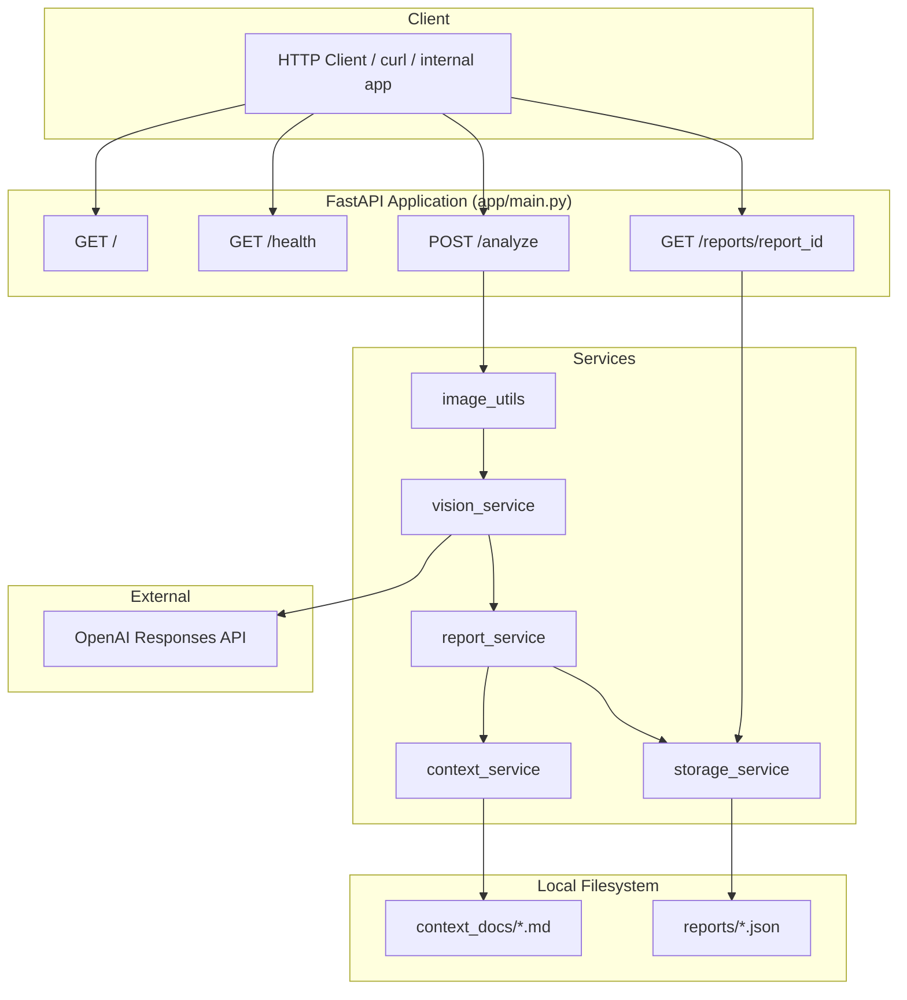

**What happens:** Clients hit REST endpoints. `/analyze` chains validation → encoding → VLM → report build → save.

**Why:** Separation keeps OpenAI integration, policy lookup, and persistence testable and replaceable without rewriting routes.

## 2.2 Request Lifecycle **[CURRENT]**

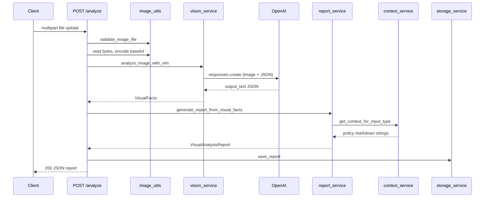

## 2.3 Service Interactions **[CURRENT]**

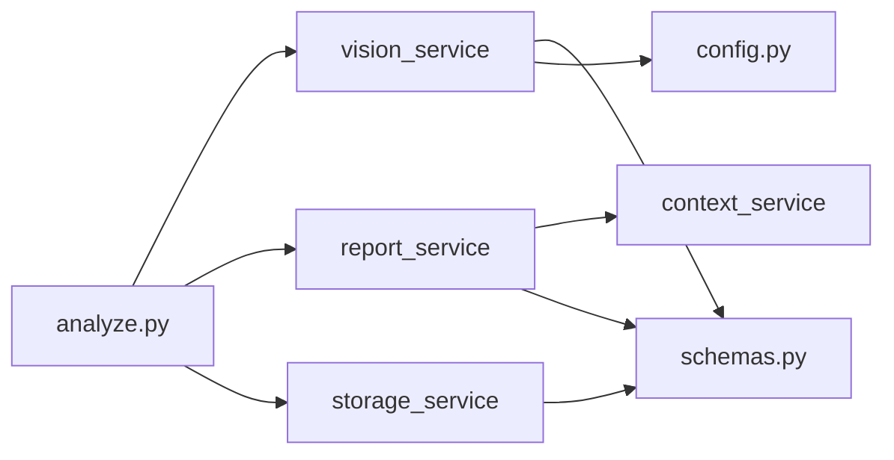

| Service | Called by | Depends on |
|---------|-----------|------------|
| `vision_service` | `analyze` route | `config`, `schemas`, OpenAI SDK |
| `report_service` | `analyze` route | `context_service`, `schemas` |
| `context_service` | `report_service` | `context_docs/` filesystem |
| `storage_service` | `analyze`, `reports` routes | `reports/` filesystem |

## 2.4 Deployment Architecture **[CURRENT]**

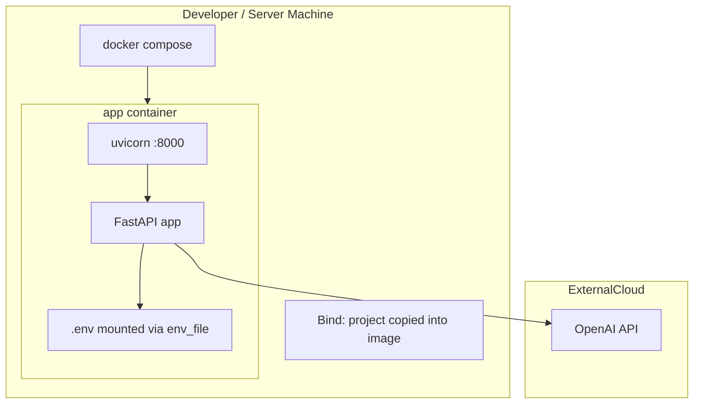

**Engineering rationale:**

- Single-container compose keeps demo and local prod-parity simple.
- `.env` supplies `OPENAI_API_KEY` and `OPENAI_MODEL` without baking secrets into the image (`.dockerignore` excludes `.env` from build context, but compose loads it at runtime).
- `reports/` is excluded from Docker build context; persisted reports inside a container would be ephemeral unless volumes are added **[FUTURE]**.

## 2.5 **[FUTURE]** Target Production Architecture (Reference)

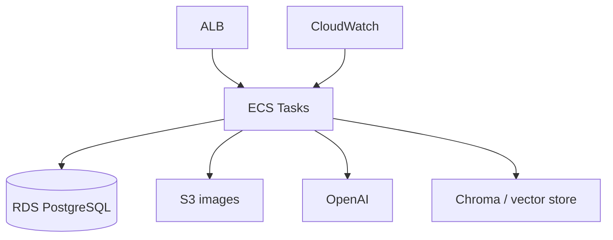

See Sections 21, 26, 27 for phased evolution.

---

# SECTION 3 — REPOSITORY WALKTHROUGH

## 3.1 Top-Level Layout

```text
enterprise-visual-intelligence-api/
├── app/                    # Application code
├── context_docs/           # Policy markdown (retrieval source)
├── docs/                   # TECHNICAL_CONTEXT.md, PDF tooling
├── reports/                # Persisted JSON reports (runtime data)
├── scripts/                # PDF generation utility
├── tests/                  # Pytest suite
├── demo/                   # demo.gif (README asset)
├── screenshots/            # README screenshots
├── Dockerfile
├── docker-compose.yml
├── requirements.txt
├── pytest.ini
├── README.md
└── Enterprise_Visual_Intelligence_API_MASTER_HANDBOOK.md  # this document
```

*Note:* `.venv-pdf/` may exist locally for PDF script dependencies; it is not part of the application runtime.

## 3.2 Application Package (`app/`)

| Path | Purpose | Responsibility | Key dependencies | System role |
|------|---------|----------------|------------------|-------------|
| `main.py` | App factory | Creates `FastAPI()`, registers routers, `GET /` | route modules | Entry point for Uvicorn |
| `config.py` | Settings | `BaseSettings`: API key, model name, app name | pydantic-settings, `.env` | Central config |
| `schemas.py` | Contracts | `VisualFacts`, `Issue`, `VisualAnalysisReport` | pydantic | API + VLM validation |

*Note:* No `__init__.py` files under `app/`; imports use `app.` prefix with `pythonpath = .` in pytest.

### Routes (`app/routes/`)

| File | Endpoints | Purpose |
|------|-----------|---------|
| `health.py` | `GET /health` | Liveness-style health JSON |
| `analyze.py` | `POST /analyze` | Full analysis pipeline orchestration |
| `reports.py` | `GET /reports/{report_id}` | Load persisted report or 404 |

### Services (`app/services/`)

| File | Purpose |
|------|---------|
| `vision_service.py` | OpenAI multimodal call + JSON parse + `VisualFacts` validation |
| `context_service.py` | Map `input_type` → policy file; read full text |
| `report_service.py` | Build `VisualAnalysisReport`, escalation, issues, actions |
| `storage_service.py` | Write/read `reports/{id}.json` |

### Utilities (`app/utils/`)

| File | Purpose |
|------|---------|
| `image_utils.py` | MIME validation; base64 encoding |

## 3.3 Policy Documents (`context_docs/`)

| File | Mapped `input_type` |
|------|---------------------|
| `warehouse_safety_rules.md` | `warehouse_scene` |
| `retail_shelf_rules.md` | `retail_shelf` |
| `equipment_inspection_rules.md` | `equipment_inspection` |
| `dashboard_anomaly_policy.md` | `dashboard_screenshot` |
| `inventory_escalation_policy.md` | `inventory_delivery` |

`unknown` → no file → empty `retrieved_context`.

## 3.4 Runtime Data (`reports/`)

| Aspect | Detail |
|--------|--------|
| Format | `{report_id}.json` — pretty-printed `VisualAnalysisReport.model_dump()` |
| Creation | Every successful `POST /analyze` |
| Retrieval | `GET /reports/{report_id}` |
| Git | Typically gitignored or local-only; `.dockerignore` excludes from image |

## 3.5 Tests (`tests/`)

Five test modules — see Section 11.

## 3.6 Operations & Docs

| Path | Purpose |
|------|---------|
| `Dockerfile` | Python 3.11-slim image, uvicorn CMD |
| `docker-compose.yml` | Single `app` service, port 8000 |
| `.dockerignore` | Excludes venv, `.env`, `reports`, caches |
| `pytest.ini` | `pythonpath = .` |
| `requirements.txt` | Runtime + test deps; **chromadb listed but unused** |
| `docs/TECHNICAL_CONTEXT.md` | Internal technical summary |
| `scripts/generate_technical_context_pdf.py` | Converts technical context MD → PDF |

## 3.7 Assets (Non-runtime)

| Path | Purpose |
|------|---------|
| `demo/demo.gif` | README demonstration |
| `screenshots/*.png` | Swagger and response screenshots for README |

---

# SECTION 4 — END TO END REQUEST FLOW

## 4.1 `POST /analyze` — Step-by-Step **[CURRENT]**

| Step | Component | Action |
|------|-----------|--------|
| 1 | FastAPI | Receives `UploadFile` via `File(...)` |
| 2 | `validate_image_file` | Rejects if `content_type` not in jpeg/jpg/png → **400** |
| 3 | `file.file.read()` | Loads entire image into memory (no size cap) |
| 4 | `encode_image_to_base64` | Standard base64 string |
| 5 | `analyze_image_with_vlm` | OpenAI call with data URL + system prompt |
| 6 | `json.loads` + Pydantic | Produce `VisualFacts` or **500** |
| 7 | `generate_report_from_visual_facts` | Policy load + escalation + `Issue` list |
| 8 | `save_report` | Write `reports/{uuid}.json` |
| 9 | FastAPI | Serialize `VisualAnalysisReport` → **200** |

## 4.2 Detailed Sequence Diagram

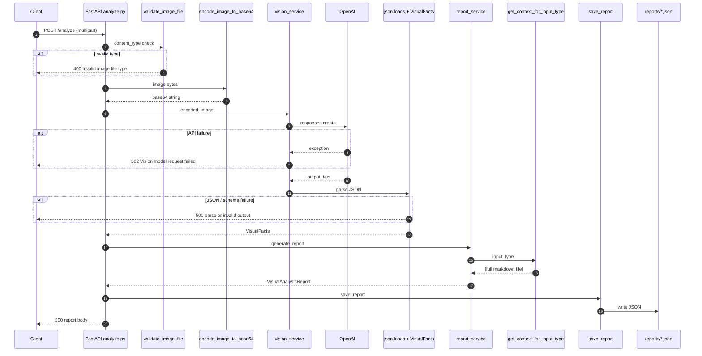

## 4.3 Code Anchors (Orchestration)

The analyze route is intentionally thin — orchestration only:

```12:21:app/routes/analyze.py
@router.post("/analyze", response_model=VisualAnalysisReport)
def analyze(file: UploadFile = File(...)):
    validate_image_file(file)
    image_bytes = file.file.read()
    encoded_image = encode_image_to_base64(image_bytes)
    visual_facts = analyze_image_with_vlm(encoded_image)

    report = generate_report_from_visual_facts(visual_facts)
    save_report(report)
    return report
```

## 4.4 Escalation Logic **[CURRENT]**

Implemented in `report_service.py`:

```16:28:app/services/report_service.py
    if (
        has_risks
        and "critical" in context_text
        and any(term in risks_text for term in critical_terms)
    ):
        escalation_level = "critical"
        issue_severity = "critical"
    elif has_risks and "high" in context_text:
        escalation_level = "high"
        issue_severity = "high"
    else:
        escalation_level = "medium" if has_risks else "low"
        issue_severity = "medium"
```

`critical_terms` = `blocked`, `exit`, `walkway`, `fire`, `obstruction`.

**Important:** This is keyword matching on policy text + risk strings, not LLM adjudication.

## 4.5 VLM Request Shape **[CURRENT]**

- Model: `settings.openai_model` (default `gpt-4o-mini`)
- API: `client.responses.create`
- Image: `data:image/png;base64,{encoded}` — **always labeled PNG** even for JPEG uploads
- Output: `text={"format": {"type": "json_object"}}`

---

# SECTION 5 — API REFERENCE

## 5.1 Overview **[CURRENT]**

| Method | Path | Auth | Response model |
|--------|------|------|----------------|
| GET | `/` | None | Ad hoc dict |
| GET | `/health` | None | Ad hoc dict |
| POST | `/analyze` | None | `VisualAnalysisReport` |
| GET | `/reports/{report_id}` | None | `VisualAnalysisReport` |

OpenAPI UI: `http://localhost:8000/docs` when server is running.

---

## 5.2 `GET /`

**Purpose:** Service identification.

**Response:**

```json
{
  "message": "Enterprise Visual Intelligence API"
}
```

*Note:* README title says “Multimodal”; root message omits “Multimodal” — minor naming inconsistency.

**Edge cases:** None significant.

---

## 5.3 `GET /health`

**Purpose:** Monitoring / readiness probe.

**Response:**

```json
{
  "status": "ok",
  "service": "enterprise-visual-intelligence-api"
}
```

**Behaviour:** Always 200 if process is up. Does **not** check OpenAI connectivity or disk writability.

**Failure cases:** Process down → connection refused (infra level).

**[FUTURE]:** Deep health: OpenAI ping, reports dir writable, policy files present.

---

## 5.4 `POST /analyze`

**Purpose:** Analyze uploaded image; persist and return report.

### Inputs

| Field | Type | Required | Constraints |
|-------|------|----------|-------------|
| `file` | `UploadFile` (multipart) | Yes | `content_type` ∈ `image/jpeg`, `image/jpg`, `image/png` |

### Example request

```bash
curl -X POST "http://localhost:8000/analyze" \
  -F "file=@warehouse-aisle.png"
```

### Success response (200)

`VisualAnalysisReport` — see Section 6.

### Example (from persisted report in repo)

```json
{
  "report_id": "ef606573-c1e0-4994-88c8-6bda6148a07e",
  "input_type": "warehouse_scene",
  "summary": "Warehouse aisle inspection completed.",
  "detected_entities": ["pallet", "forklift", "walkway"],
  "visual_facts": ["A pallet is blocking part of the aisle."],
  "issues": [{
    "issue_type": "possible_risk",
    "description": "Blocked walkway may create a safety risk.",
    "evidence": "Blocked walkway may create a safety risk.",
    "severity": "critical"
  }],
  "retrieved_context": ["# Warehouse Safety Rules\n\n- If emergency exits..."],
  "recommended_actions": ["Review and address: Blocked walkway may create a safety risk."],
  "escalation_level": "critical",
  "confidence": 0.85,
  "limitations": ["AI-generated analysis; verify findings before acting."]
}
```

### Expected behaviour

1. Validate MIME type (client-provided `content_type`, not magic-byte sniffing).
2. Call OpenAI (requires valid `OPENAI_API_KEY`).
3. Build report with policy context.
4. Save JSON file.
5. Return report.

### Edge cases

| Scenario | Behaviour |
|----------|-----------|
| Wrong MIME type | 400 `Invalid image file type` |
| Missing API key / OpenAI error | 502 `Vision model request failed` |
| Non-JSON model output | 500 `Failed to parse VLM response` |
| JSON fails Pydantic | 500 `Invalid structured VLM output` |
| `input_type: unknown` | Empty `retrieved_context`; escalation still from risks |
| No `possible_risks` | `escalation_level: low`, empty issues |
| Large images | No server-side size limit — memory risk |

### Failure cases summary

| Status | Detail string |
|--------|---------------|
| 400 | Invalid image file type |
| 502 | Vision model request failed |
| 500 | Failed to parse VLM response / Invalid structured VLM output |

---

## 5.5 `GET /reports/{report_id}`

**Purpose:** Retrieve previously saved analysis.

### Inputs

| Param | Type | Description |
|-------|------|-------------|
| `report_id` | path string | UUID or any filename stem used at save time |

### Example

```bash
curl "http://localhost:8000/reports/ef606573-c1e0-4994-88c8-6bda6148a07e"
```

### Success (200)

JSON matching `VisualAnalysisReport` (loaded from disk; validated on response).

### Failure (404)

```json
{
  "detail": "Report not found"
}
```

### Edge cases

| Scenario | Behaviour |
|----------|-----------|
| Path traversal attempt (e.g. `../`) | Looks for literal filename `../.json` under reports — not a classic traversal exploit but no sanitization |
| Report saved but schema evolved | Old files may fail response validation if schema changes **[risk]** |
| `load_report` returns `dict` | FastAPI coerces via `response_model` |

---

# SECTION 6 — DATA MODELS

## 6.1 Schema Relationship Diagram **[CURRENT]**

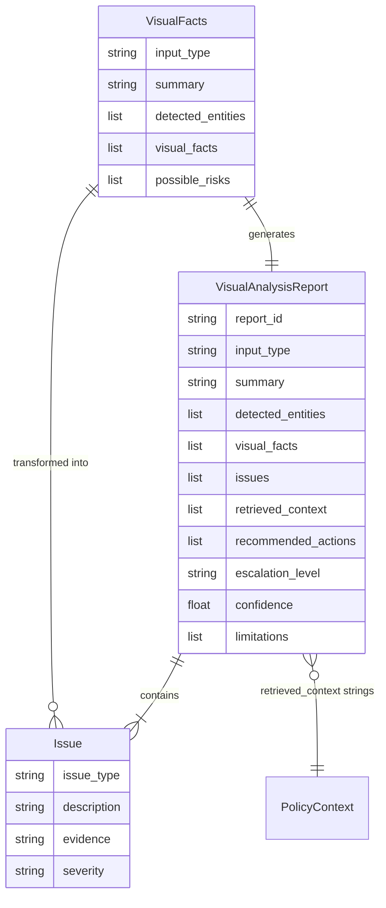

## 6.2 `VisualFacts` — VLM Output Contract

| Field | Type | Description | Business value | Validation |
|-------|------|-------------|----------------|------------|
| `input_type` | Literal (6 values) | Scene classification | Routes policy retrieval | Invalid value → 500 at API |
| `summary` | str | Short operational summary | Executive scan | Required string |
| `detected_entities` | list[str] | Visible objects | Inventory of scene | Prompt asks ≥3 when possible |
| `visual_facts` | list[str] | Observable statements | Evidence chain | Free text |
| `possible_risks` | list[str] | Candidate issues | Drives issues + escalation | Empty → low escalation |

**Why separate from `VisualAnalysisReport`:** Clean boundary between **model perception** and **business report** (policy, escalation, persistence ID).

## 6.3 `Issue`

| Field | Type | Description | Business value |
|-------|------|-------------|----------------|
| `issue_type` | str | Category | Routing to workflows; currently often `possible_risk` |
| `description` | str | Human-readable issue | Operator action |
| `evidence` | str | Supporting observation | Audit; today often duplicates description |
| `severity` | low\|medium\|high\|critical | Priority | Ticketing integration |

**Validation:** Pydantic `Literal` on severity.

## 6.4 `VisualAnalysisReport` — API & Persistence Contract

| Field | Type | Why it exists | Business value |
|-------|------|---------------|----------------|
| `report_id` | str (UUID) | Idempotency of retrieval | Audit trail key |
| `input_type` | Literal | Scenario | Policy + analytics segmentation |
| `summary` | str | Headline | Dashboards |
| `detected_entities` | list[str] | Structured inventory | Search / filtering **[FUTURE]** |
| `visual_facts` | list[str] | Grounded observations | Explainability |
| `issues` | list[Issue] | Actionable problems | Work orders |
| `retrieved_context` | list[str] | Policy transparency | Compliance (“show your work”) |
| `recommended_actions` | list[str] | Next steps | SOP automation |
| `escalation_level` | none\|low\|medium\|high\|critical | Ops priority | Paging rules |
| `confidence` | float | Trust signal | Human-in-the-loop thresholds |
| `limitations` | list[str] | Disclaimers | Legal / safety |

**Validation notes:**

- `escalation_level` includes `"none"` in schema; `report_service` never sets `"none"` today (storage tests use it manually).
- `confidence` is **hardcoded 0.85** in `report_service` — not model-derived.

## 6.5 `Settings` (config, not API body)

| Field | Default | Purpose |
|-------|---------|---------|
| `app_name` | enterprise-visual-intelligence-api | Identifier |
| `openai_api_key` | "" | OpenAI auth |
| `openai_model` | gpt-4o-mini | VLM selection |

---

# SECTION 7 — SERVICE LAYER DEEP DIVE

## 7.1 `vision_service.py` **[CURRENT]**

| Aspect | Detail |
|--------|--------|
| **Responsibility** | Single external AI call; parse and validate structured output |
| **Internal logic** | Module-level `OpenAI` client; system prompt defines JSON keys; user message is image only |
| **Strengths** | Clear error mapping (502 vs 500); schema gate on VLM output |
| **Limitations** | Broad `except Exception` → 502; no retries; no timeout config; PNG data URL for all types |
| **Future evolution** | Retry with backoff; correct MIME; optional second-pass; model routing by scene |

## 7.2 `context_service.py` **[CURRENT]**

| Aspect | Detail |
|--------|--------|
| **Responsibility** | Resolve policy document path from `input_type`; return full file text |
| **Internal logic** | Static `CONTEXT_BY_INPUT_TYPE` dict; `read_text()` |
| **Strengths** | Simple, deterministic, easy to audit |
| **Limitations** | No chunking; `unknown` gets nothing; entire policy may exceed useful context window for LLM steps **[FUTURE]** |
| **Future evolution** | Chunk + embed + top-k retrieval (Section 23) |

## 7.3 `report_service.py` **[CURRENT]**

| Aspect | Detail |
|--------|--------|
| **Responsibility** | Transform `VisualFacts` → `VisualAnalysisReport` |
| **Internal logic** | Keyword escalation; map each `possible_risk` to `Issue`; template recommended actions |
| **Strengths** | Predictable; testable without API key |
| **Limitations** | Heuristic severity; evidence = description; static confidence; no LLM synthesis of narrative report |
| **Future evolution** | LLM report node with cited policy chunks; severity from policy rules engine |

## 7.4 `storage_service.py` **[CURRENT]**

| Aspect | Detail |
|--------|--------|
| **Responsibility** | Persist and load reports as JSON files |
| **Internal logic** | `mkdir`; `write_text(json.dumps(model_dump()))`; `read_text` + `json.loads` |
| **Strengths** | Human-readable audit files; zero infra |
| **Limitations** | No concurrency control; no query API; not shared across replicas without shared volume |
| **Future evolution** | SQLAlchemy repository (Section 22) |

---

# SECTION 8 — AI SYSTEM DESIGN

## 8.1 Why GPT-4o Mini **[CURRENT]**

| Factor | Rationale |
|--------|-----------|
| Cost / latency | Mini variant suitable for portfolio and moderate-volume demos |
| Multimodal | Native image input via Responses API |
| JSON mode | `json_object` format supports structured extraction |
| Configurable | `OPENAI_MODEL` env override without code change |

**[FUTURE] alternatives:** GPT-4o for higher accuracy; fine-tuned specialist models; self-hosted VLMs for data residency.

## 8.2 Why Multimodal AI (VLM)

Operational images are **semantically diverse**. A single VLM prompt can classify scene type and extract entities across warehouse, retail, and dashboards without training separate YOLO/detector models per domain.

## 8.3 Why Structured Outputs Matter

Enterprise workflows need **fields**, not paragraphs:

- Ticketing systems need `severity`, `issue_type`
- Dashboards need `escalation_level`, `confidence`
- Compliance needs `retrieved_context` and `limitations`

JSON mode + Pydantic prevents unbounded prose and enables tests against shapes.

## 8.4 Why Schema Validation Matters

The VLM can hallucinate keys or invalid `input_type`. `ValidationError` → HTTP 500 protects downstream policy mapping from garbage input.

## 8.5 VLM vs Traditional Computer Vision

| Dimension | VLM (this project) | Traditional CV |
|-----------|------------------|----------------|
| Setup | Prompt + schema | Datasets, training, per-class detectors |
| Generalization | Cross-domain with one pipeline | Strong within trained distribution |
| Explainability | Natural language facts | Bounding boxes, class scores |
| Cost | Per-token / per-image API | Infra + ML ops |
| Determinism | Stochastic | More reproducible metrics |
| Policy alignment | Needs separate grounding step | Rules on detected objects |

**Tradeoff summary:** This project trades **ML ops complexity** for **API cost and nondeterminism**, mitigated by schema validation and policy grounding.

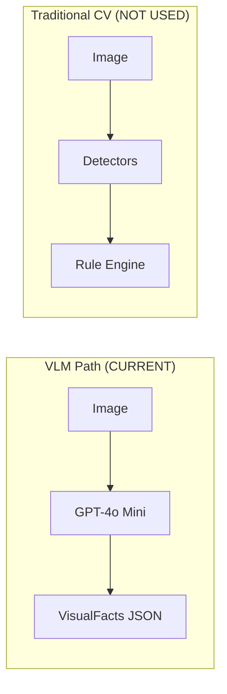

---

# SECTION 9 — POLICY GROUNDING DESIGN

## 9.1 How Policy Retrieval Works **[CURRENT]**

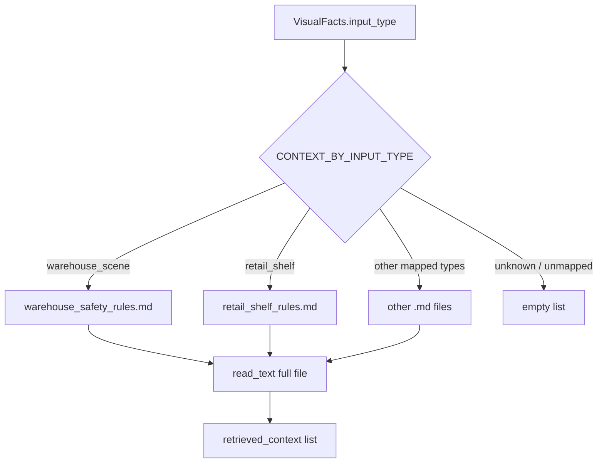

1. VLM sets `input_type`.
2. `get_context_for_input_type` loads **entire** markdown file into one string in a list.
3. `report_service` lowercases joined context for keyword checks (`critical`, `high`).
4. Full policy text is echoed in API response for transparency.

## 9.2 Why Implemented This Way

| Reason | Explanation |
|--------|-------------|
| Simplicity | No vector DB, embeddings, or chunk pipeline |
| Determinism | Same input_type → same policy file every time |
| Interview narrative | Demonstrates “grounding” concept before full RAG |
| Transparency | Clients see exact policy text used |

## 9.3 Strengths & Limitations

| Strengths | Limitations |
|-----------|-------------|
| Easy to edit policies (markdown in repo) | No semantic search across policies |
| Auditable retrieval | Large policies not ranked by relevance |
| No embedding cost | Misclassified `input_type` → wrong policy |
| Fast local I/O | Keywords in report logic only loosely couple to policy bullets |

## 9.4 vs True RAG **[CURRENT vs FUTURE]**

| Aspect | Current “lookup grounding” | True RAG **[FUTURE]** |
|--------|---------------------------|----------------------|
| Retrieval unit | Whole file | Top-k chunks |
| Matching | `input_type` key | Embedding similarity + filters |
| Updates | Git commit | Index rebuild / incremental |
| Hallucination risk | Lower for policy text (verbatim) | Requires citation discipline |
| Infra | Filesystem | Vector DB (e.g. ChromaDB) |

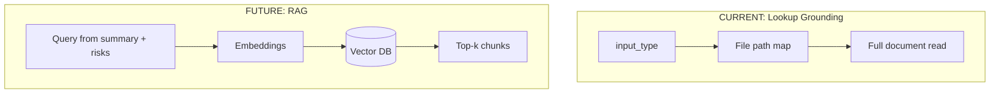

---

# SECTION 10 — PERSISTENCE DESIGN

## 10.1 JSON File Storage **[CURRENT]**

**Path pattern:** `reports/{report_id}.json`

**Write path:**

```9:13:app/services/storage_service.py
def save_report(report: VisualAnalysisReport) -> str:
    REPORTS_DIR.mkdir(parents=True, exist_ok=True)
    report_path = REPORTS_DIR / f"{report.report_id}.json"
    report_path.write_text(json.dumps(report.model_dump(), indent=2))
    return report.report_id
```

## 10.2 Strengths

| Strength | Detail |
|----------|--------|
| Simplicity | No DB provisioning |
| Auditability | Files are human-readable |
| Debuggability | Inspect reports directly in repo or volume |
| Portability | Easy export/import for demos |

## 10.3 Limitations

| Limitation | Why it matters |
|------------|----------------|
| No querying | Cannot list reports by date, type, escalation without scanning files |
| Concurrency | Race conditions if multiple writers same ID (UUID mitigates) |
| Scale | Thousands of files slow on some filesystems |
| Multi-instance | ECS replicas need shared EFS/S3 — not in current design |
| Schema migration | No versioning field on stored documents |
| Security | No encryption at rest in application layer |

## 10.4 Auditability **[CURRENT]**

Each analysis leaves a durable artifact suitable for demo audit trails. **Gap:** No immutable log, signer, or user attribution.

## 10.5 Scalability Concerns

Sync write on request path blocks response until disk flush. High throughput needs async queue + object store **[FUTURE]**.

---

# SECTION 11 — TESTING STRATEGY

## 11.1 Philosophy **[CURRENT]**

- Fast unit tests for pure logic and schemas
- Integration-style test for `/analyze` with **mocked VLM** at route boundary (no OpenAI spend in CI)
- Isolated temp directory for storage tests via `patch`

## 11.2 Test Inventory

| Test file | What it validates | Why it matters |
|-----------|-------------------|----------------|
| `test_health.py` | `GET /health` status and body | Proves app wiring and monitoring contract |
| `test_analyze_mock.py` | Full `/analyze` with patched `analyze_image_with_vlm` | Pipeline integration without API key |
| `test_schema.py` | Valid/invalid `input_type` on `VisualAnalysisReport` | Contract enforcement |
| `test_image_utils.py` | Base64 encoding; MIME validation | Input gate correctness |
| `test_storage_service.py` | save/load round-trip with patched `REPORTS_DIR` | Persistence correctness |

## 11.3 Coverage Gaps **[CURRENT]**

| Area | Status |
|------|--------|
| `report_service` escalation matrix | Not tested |
| `context_service` unknown / missing file | Not tested |
| `vision_service` error branches | Not tested |
| `GET /reports` 404 | Not tested |
| Live OpenAI integration | Not in CI (appropriate) |

## 11.4 Mocked Components

```python
# test_analyze_mock.py patches:
"app.routes.analyze.analyze_image_with_vlm"
```

**Design choice:** Patch at route import path so the real report and storage logic execute.

## 11.5 Running Tests

```bash
pytest
```

`pytest.ini`: `pythonpath = .`

---

# SECTION 12 — DOCKER & DEPLOYMENT

## 12.1 Dockerfile **[CURRENT]**

| Stage | Instruction | Implication |
|-------|-------------|-------------|
| Base | `python:3.11-slim` | Matches local Python 3.11 target |
| Deps | `pip install -r requirements.txt` | Includes unused chromadb |
| Copy | `COPY . .` | Full app + context_docs; excludes via .dockerignore |
| CMD | uvicorn `0.0.0.0:8000` | Production-style bind |

## 12.2 docker-compose **[CURRENT]**

```yaml
services:
  app:
    build: .
    ports:
      - "8000:8000"
    env_file:
      - .env
    restart: unless-stopped
```

## 12.3 Runtime Architecture

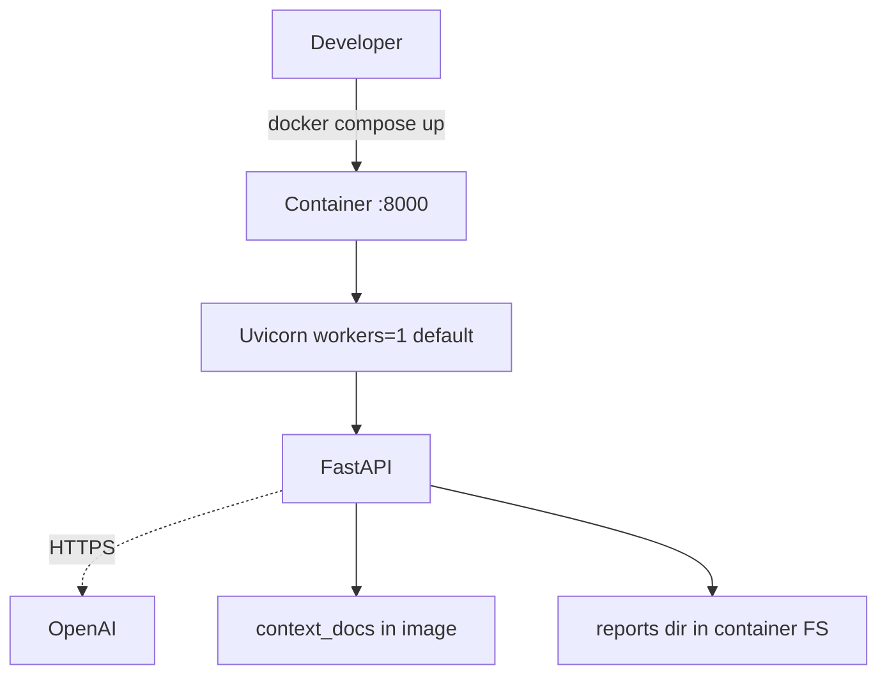

## 12.4 Deployment Implications

| Topic | Current state |
|-------|---------------|
| Secrets | `.env` on host — not in image build |
| Persistence | Reports lost on container recreate unless volume mounted |
| Horizontal scale | Stateless except local `reports/` |
| Health checks | No Docker `HEALTHCHECK` instruction |
| TLS | Not terminated in container |

---

# SECTION 13 — ENGINEERING DECISIONS

## 13.1 Decision Log

| Decision | Why chosen | Alternatives | Tradeoffs | Consequences |
|----------|------------|--------------|-----------|--------------|
| **FastAPI** | Async-capable, automatic OpenAPI, Pydantic-native | Flask, Django REST | Less batteries than Django | Excellent docs UX; team must add auth/ORM separately |
| **Pydantic** | Strict contracts for VLM + API | dataclasses, marshmallow | Learning curve | Invalid AI output caught early |
| **Docker** | Reproducible demos and interviews | bare metal venv | Image size, compose overhead | One-command run for reviewers |
| **OpenAI** | Best-in-class multimodal API speed to market | Azure OpenAI, Anthropic, local LLaVA | Vendor lock-in, cost | Requires API key management |
| **JSON persistence** | Zero setup audit files | SQLite, Postgres, S3 | No query layer | Fast to build; refactor needed for scale |
| **Service layer** | Testability and separation | Fat controllers | More files | Clear ownership per concern |
| **Structured outputs** | Enterprise field requirements | Free-form completion | Prompt engineering burden | Enables mocking and validation |

---

# SECTION 14 — CURRENT STRENGTHS

## 14.1 Honest Evaluation **[CURRENT]**

| Dimension | Assessment |
|-----------|------------|
| Architecture quality | **Strong for scope** — clear routes → services → schemas |
| Maintainability | **Good** — small codebase (~11 Python modules in app) |
| Production readiness | **Low** — no auth, observability, CI, or HA persistence |
| AI engineering quality | **Good prototype** — structured VLM + validation; weak evals |
| API quality | **Good** — typed responses, OpenAPI, sensible errors |

## 14.2 What Impresses Recruiters / Interviewers

1. End-to-end multimodal pipeline with **policy grounding narrative**
2. **Pydantic boundaries** between VLM output and business report
3. **Escalation semantics** tied to policy language
4. **Persistence + retrieval** (not stateless demo)
5. **Docker** + documented curl workflows
6. **Tests with mocked AI** (shows CI awareness)
7. Domain breadth (5 scenario types + policy corpus)
8. Honest README roadmap section

---

# SECTION 15 — CURRENT LIMITATIONS

| Gap | Current state | Why it matters |
|-----|---------------|----------------|
| Database | JSON files only | No analytics queries, migrations hard |
| Retrieval | Full-file lookup; chromadb unused | Wrong policy if misclassified; no semantic match |
| Authentication | Public endpoints | Cannot deploy safely on internet |
| Observability | No structured logs/metrics/tracing | Cannot debug latency or model failures in prod |
| Deployment | Local Docker only | No SLA, no autoscaling story |
| Infrastructure as code | None | Environment drift |
| Evaluation | None | Cannot prove model quality regressions |
| Orchestration | Single sync handler | Long VLM calls block workers |
| Image pipeline | MIME-only; PNG data URL | Wrong labeling; abuse via huge uploads |
| Confidence | Static 0.85 | Misleading trust signal |
| Policy reasoning | Keywords | May not match policy intent |
| CI/CD | No `.github/workflows` | Regressions slip through |
| Health depth | Process-only | False confidence during OpenAI outages |

---

# SECTION 16 — FDE COMPETENCY MAPPING

| Feature / artifact | Engineering skill demonstrated |
|--------------------|--------------------------------|
| FastAPI REST API | Backend API design |
| Pydantic schemas | API contracts & validation |
| OpenAI Responses API + JSON mode | LLM / VLM integration |
| `VisualFacts` vs `VisualAnalysisReport` | AI output structuring |
| `context_service` policy lookup | Grounding / retrieval basics |
| `report_service` escalation | Business rules + risk scoring |
| JSON persistence + GET retrieval | Data persistence patterns |
| Docker + compose | Container deployment |
| Pytest + httpx TestClient | Quality engineering |
| Mocked VLM in tests | Testable AI systems |
| `context_docs/` corpus | Domain modeling |
| Multipart upload handling | File ingestion |
| README + OpenAPI | Technical communication |
| TECHNICAL_CONTEXT.md | Architecture documentation |
| **[FUTURE]** items in roadmap | Forward-deployed planning |

---

# SECTION 17 — INTERVIEW DEFENSE GUIDE

## 17.1 FastAPI

| | Content |
|---|--------|
| **Question** | Why FastAPI instead of Flask? |
| **Strong answer** | “I needed automatic OpenAPI for integrators, native Pydantic validation for VLM JSON, and async-ready stack for future IO-bound scaling. The analyze route is sync today because the OpenAI SDK call is blocking, but FastAPI lets us add async routes and middleware later without rewriting.” |
| **Weak answer** | “It’s popular.” |
| **Red flags** | Cannot explain sync vs async on current route |
| **Follow-ups** | How would you add auth middleware? Background tasks for long images? |

## 17.2 JSON Persistence

| | Content |
|---|--------|
| **Question** | Why files instead of a database? |
| **Strong answer** | “Phase one optimized for zero infra and human-readable audit artifacts for demos. I’d migrate reports to SQLite with SQLAlchemy next—same Pydantic models, repository pattern—before multi-replica ECS.” |
| **Weak answer** | “Databases are hard.” |
| **Red flags** | Claims JSON scales to millions of reports without caveats |
| **Follow-ups** | Schema migrations? Query by escalation_level? |

## 17.3 Policy Lookup vs RAG

| | Content |
|---|--------|
| **Question** | Is this RAG? |
| **Strong answer** | “Not embedding RAG—it’s deterministic grounding: classify scene, load the policy file, expose verbatim context in the response. Real RAG would chunk, embed, and retrieve top-k by semantic similarity—planned with ChromaDB.” |
| **Weak answer** | “Yes we use RAG” (inaccurate for current code) |
| **Red flags** | Cannot explain retrieval unit or failure modes |
| **Follow-ups** | How prevent wrong policy on misclassification? |

## 17.4 Structured VLM Outputs

| | Content |
|---|--------|
| **Question** | Why not return free text from the model? |
| **Strong answer** | “Downstream systems need typed fields for ticketing and escalation. JSON mode plus Pydantic gives a contract we can test and mock; failures become 500 instead of silent schema drift.” |
| **Weak answer** | “JSON is trendy.” |
| **Follow-ups** | How handle schema violations in production? Retry prompts? |

## 17.5 Rule-Based Escalation

| | Content |
|---|--------|
| **Question** | Why not let the LLM set escalation? |
| **Strong answer** | “I separated perception from policy adjudication for debuggability. Keywords over policy text are a deliberate MVP—I’d add a second LLM pass with retrieved chunks and citations, plus eval datasets, before trusting model-only severity.” |
| **Weak answer** | “Rules are simpler.” (without acknowledging limits) |
| **Follow-ups** | Show example where keyword logic fails |

## 17.6 GPT-4o Mini

| | Content |
|---|--------|
| **Question** | Why this model? |
| **Strong answer** | “Cost/latency for portfolio throughput; multimodal support; configurable via env. I’d benchmark against GPT-4o on labeled warehouse images before production.” |
| **Weak answer** | “It’s the best.” |
| **Follow-ups** | Cost per 1000 images? Fallback model? |

---

# SECTION 18 — SYSTEM DESIGN INTERVIEW VERSION

## 18.1 Two Minutes

**Talking points:** Image upload API → VLM extracts structured facts → policy file by scene type → escalation report → JSON persistence → GET by ID. Monolith FastAPI, Docker, mocked tests.


## 18.2 Five Minutes

Add: Pydantic contracts, explicit `retrieved_context`, keyword escalation rationale, OpenAI Responses API, gaps (auth, RAG, DB), roadmap phases.

## 18.3 Fifteen Minutes

Add: sequence walkthrough, failure codes, scale limits (sync, file storage), multi-tenant **[FUTURE]**, observability design, eval harness **[FUTURE]**, comparison to CV pipeline.

## 18.4 Thirty Minutes

Add: deep dive Sections 8–10, SQL migration sketch, RAG diagram, AWS target architecture, security model, cost model, Q&A on tradeoffs.

**Whiteboard diagram (core):**

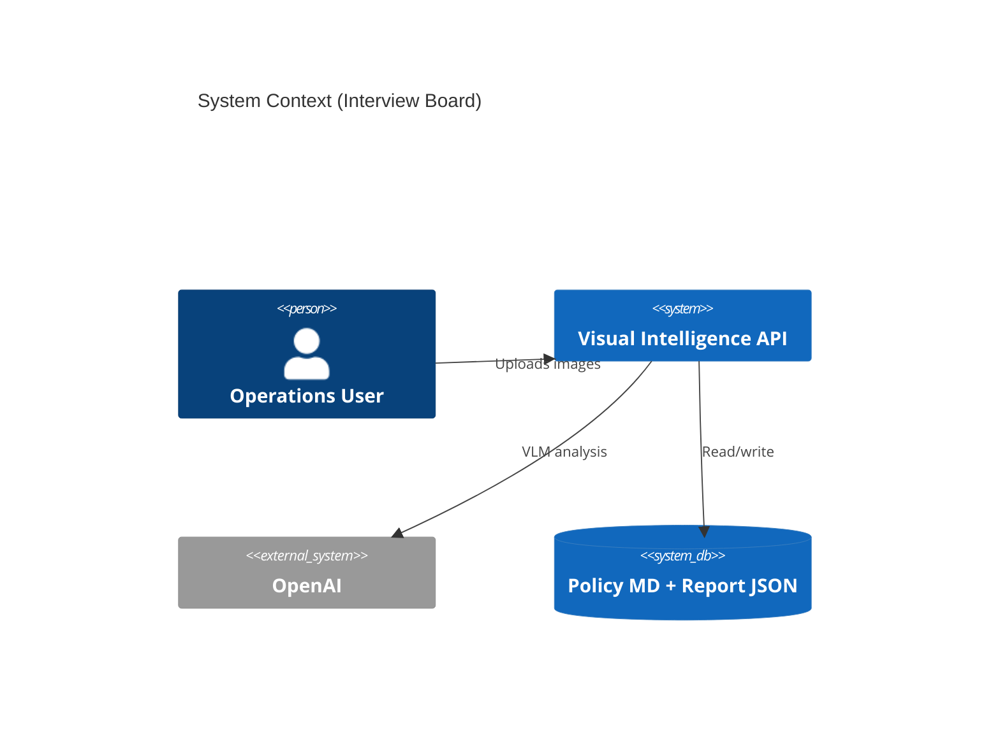

---

# SECTION 19 — BEHAVIOURAL INTERVIEW STORIES

*Use STAR format. Adapt metrics to your real experience.*

## 19.1 Designing Architecture

**Situation:** Needed a demonstrable enterprise multimodal API for portfolio and interviews.  
**Task:** Design a system that shows policy-grounded AI, not just image captioning.  
**Action:** Chose FastAPI service layer split (vision, context, report, storage); defined separate `VisualFacts` and `VisualAnalysisReport` schemas; mapped five operational domains to markdown policies.  
**Result:** Reviewers can trace upload-to-report in <15 minutes; OpenAPI documents contracts.

## 19.2 Integrating AI

**Situation:** Unstructured model output unusable for escalation workflows.  
**Task:** Integrate OpenAI vision with reliable fields.  
**Action:** Used Responses API JSON mode, strict system prompt for keys, Pydantic validation with distinct HTTP errors for API vs parse vs schema failures.  
**Result:** Mocked integration tests run without API keys; live demos produce consistent JSON shape.

## 19.3 Testing

**Situation:** CI cannot depend on OpenAI availability or cost.  
**Task:** Test `/analyze` end-to-end.  
**Action:** Patched `analyze_image_with_vlm` at route level; kept report and storage real.  
**Result:** Regression protection on orchestration; documented gap for escalation unit tests.

## 19.4 Deployment

**Situation:** Reviewers need one-command run.  
**Task:** Containerize API with policy docs bundled.  
**Action:** Dockerfile + compose with env_file for secrets; .dockerignore excludes local reports and .env from image layers.  
**Result:** `docker compose up --build` exposes port 8000 with Swagger.

## 19.5 Debugging

**Situation:** VLM returned markdown-wrapped JSON or wrong keys during development.  
**Task:** Harden parsing path.  
**Action:** Separated JSONDecodeError and ValidationError into different 500 messages; inspected `output_text` in logs **[manual today — no structured logging]**.  
**Result:** Faster diagnosis of prompt vs model issues.

## 19.6 Handling Uncertainty

**Situation:** Model confidence not provided by API in structured form.  
**Task:** Ship a confidence field for API completeness.  
**Action:** Documented static 0.85 as MVP; listed in limitations; roadmap for calibration via eval harness.  
**Result:** Honest API contract with explicit future work.

## 19.7 Making Tradeoffs

**Situation:** Time box for portfolio delivery.  
**Task:** Choose retrieval approach.  
**Action:** Implemented file lookup grounding instead of Chroma RAG; kept chromadb in requirements as placeholder **[technical debt]**.  
**Result:** Shipped grounding narrative quickly; clear upgrade path documented.

---

# SECTION 20 — RESUME BULLETS

## 20.1 Recruiter-Friendly

- Built a **FastAPI** service that analyzes operational images with **OpenAI vision models** and returns structured safety and compliance reports.
- Designed **Dockerized** deployment and **pytest** suite with mocked AI for reliable automated testing.
- Integrated **policy-grounded** reporting across warehouse, retail, equipment, and dashboard scenarios.

## 20.2 Hiring-Manager

- Delivered end-to-end **multimodal AI pipeline**: upload validation → VLM structured extraction → policy context → escalation-aware JSON reports with persistence and retrieval APIs.
- Established **typed contracts** (Pydantic) between ML output and business logic to reduce production schema drift.
- Documented architecture, API examples, and production roadmap for stakeholder alignment.

## 20.3 Senior Engineer

- Architected **service-oriented monolith** separating vision, context retrieval, report generation, and storage with clear failure semantics (400/502/500).
- Implemented **deterministic policy grounding** with transparent `retrieved_context` for auditability; defined path to **vector RAG** and **SQL persistence**.
- Identified and documented **production gaps** (auth, observability, evals, CI) with phased remediation plan.

## 20.4 FDE-Focused

- Built **forward-deployable prototype** simulating enterprise visual ops workflows: multimodal ingestion, structured extraction, policy escalation, and report APIs for integration into customer ops tools.
- Partnered-with-customer-style **domain modeling** via markdown policy corpus mapped to operational `input_type` taxonomy.
- Prepared **scale-up playbook**: SQLite → Chroma RAG → LangGraph orchestration → AWS/Terraform.

---

# SECTION 21 — ROADMAP TO FDE LEVEL

## Phase 1 — Foundation **[FUTURE]**

| Item | Implementation approach | Files likely affected | Architecture change | Interview value | Difficulty |
|------|-------------------------|----------------------|---------------------|-----------------|------------|
| CI/CD | GitHub Actions: pytest on PR | `.github/workflows/ci.yml` | Automated quality gate | High | Low |
| Logging | structlog/loguru + request ID middleware | `app/main.py`, new `middleware/` | Observable requests | High | Low |
| Auth | API key header dependency | `app/deps.py`, routes | Secured endpoints | High | Low–Med |
| SQLAlchemy | Engine + session; Report ORM | `app/db/`, `storage_service.py` | Queryable reports | High | Med |
| Alembic | Migrations for report table | `alembic/` | Schema evolution | Med | Med |

## Phase 2 — RAG **[FUTURE]**

| Item | Approach | Files | Change | Value | Difficulty |
|------|----------|-------|--------|-------|------------|
| ChromaDB | Index chunked `context_docs` | `context_service.py`, new `indexing/` | Semantic retrieval | Very High | Med |
| Embeddings | OpenAI `text-embedding-3-small` | new `embedding_service.py` | Vector pipeline | High | Med |

## Phase 3 — Evaluation **[FUTURE]**

| Item | Approach | Files | Change | Value | Difficulty |
|------|----------|-------|--------|-------|------------|
| Eval harness | Labeled images + JSON gold | `evals/`, scripts | Quality metrics | Very High | Med–High |

## Phase 4 — LangGraph **[FUTURE]**

| Item | Approach | Files | Change | Value | Difficulty |
|------|----------|-------|--------|-------|------------|
| Orchestration | Stateful graph: visual → retrieve → assess → report | `app/graph/` | Agentic workflow | High | High |

## Phase 5 — AWS **[FUTURE]**

| Item | Approach | Files | Change | Value | Difficulty |
|------|----------|-------|--------|-------|------------|
| ECS + ECR | Container deploy | `deploy/aws/` | Cloud runtime | High | High |

## Phase 6 — Terraform **[FUTURE]**

| Item | Approach | Files | Change | Value | Difficulty |
|------|----------|-------|--------|-------|------------|
| IaC | Modules for VPC, ECS, RDS, IAM | `terraform/` | Reproducible infra | High | High |

---

# SECTION 22 — SQLALCHEMY MIGRATION PLAN **[FUTURE]**

## 22.1 Target Schema

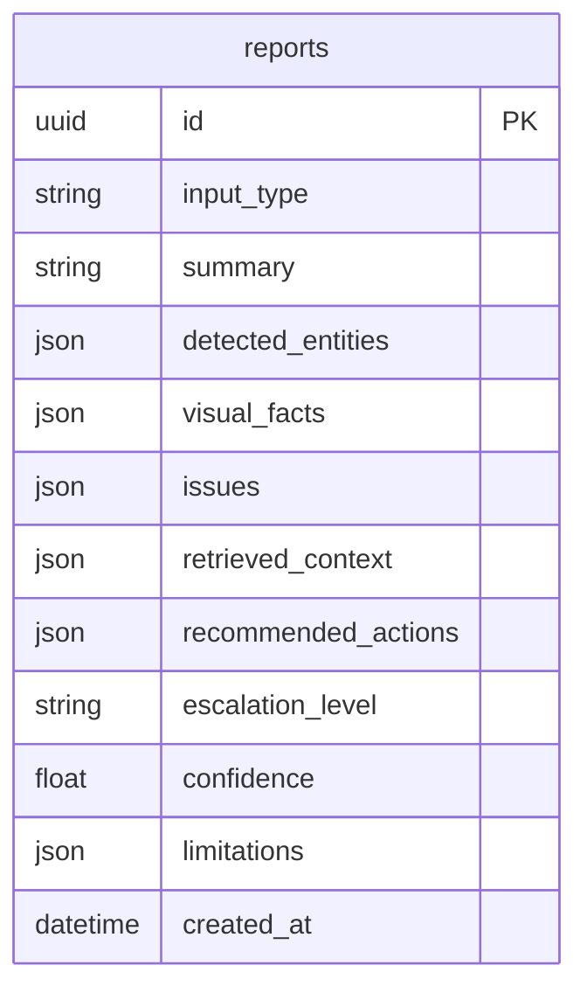

## 22.2 ORM Model (Sketch)

```python
# Illustrative — NOT in repo
class ReportRow(Base):
    __tablename__ = "reports"
    id: Mapped[str] = mapped_column(String(36), primary_key=True)
    input_type: Mapped[str] = mapped_column(String(64), index=True)
    payload: Mapped[dict] = mapped_column(JSON)  # or normalized columns
    created_at: Mapped[datetime] = mapped_column(DateTime, server_default=func.now())
```

## 22.3 Migration Steps

1. Add SQLAlchemy + Alembic dependencies.
2. Create `app/db/session.py` and `app/models/report.py`.
3. Implement `SqlAlchemyReportRepository` parallel to file storage.
4. Feature flag `STORAGE_BACKEND=json|sqlite`.
5. One-off script: import `reports/*.json` into DB.
6. Switch default to sqlite; keep JSON export command.

## 22.4 Risks & Benefits

| Risks | Benefits |
|-------|----------|
| Migration bugs | `WHERE escalation_level = 'critical'` |
| Dual-write complexity | Indexing for dashboards |
| SQLite limits on heavy write concurrency | Path to Postgres/RDS |

---

# SECTION 23 — RAG ARCHITECTURE PLAN **[FUTURE]**

## 23.1 Why ChromaDB

| Criterion | Chroma |
|-----------|--------|
| Already in `requirements.txt` | Reduces new deps |
| Embedded mode | No separate server for portfolio |
| Python-native | Fits FastAPI stack |
| Upgrade path | Can move to managed vector DB later |

## 23.2 Chunking Strategy

| Policy doc | Suggested chunks |
|------------|------------------|
| Warehouse rules | Split per bullet line |
| Retail rules | Split per bullet |
| Dashboard policy | Split per KPI rule |

Metadata: `input_type`, `source_file`, `section_title`.

## 23.3 Retrieval Pipeline

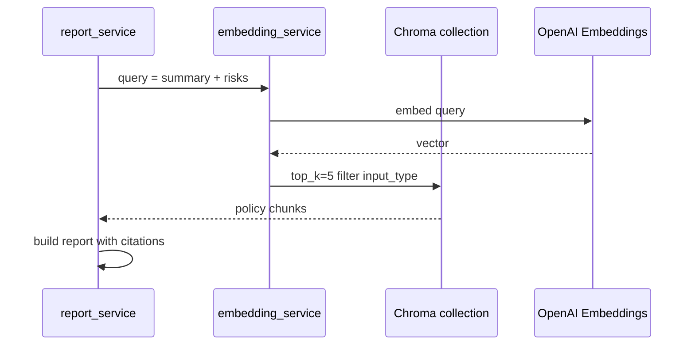

## 23.4 Index Build (Offline)

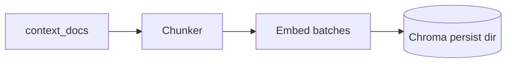

---

# SECTION 24 — EVALUATION FRAMEWORK PLAN **[FUTURE]**

## 24.1 Dataset Structure

```text
evals/
├── images/
│   warehouse_blocked_aisle_01.png
│   retail_empty_shelf_01.png
├── gold/
│   warehouse_blocked_aisle_01.json  # expected VisualFacts fields
└── manifest.csv
```

## 24.2 Metrics

| Metric | Definition |
|--------|------------|
| `input_type_accuracy` | Exact match on classification |
| `entity_recall` | Overlap with gold entities |
| `risk_detection_recall` | Gold risks found in output |
| `escalation_accuracy` | Match gold escalation |
| `schema_validity_rate` | % parses without 500 |
| `latency_p95` | End-to-end ms |

## 24.3 Benchmarking Process

1. Run eval script against live or recorded VLM responses.
2. Store run ID + git SHA + model name.
3. Compare to baseline threshold in CI (non-blocking at first).
4. Human review queue for regressions on critical safety images.

---

# SECTION 25 — LANGGRAPH PLAN **[FUTURE]**

## 25.1 Proposed Nodes

| Node | Input | Output |
|------|-------|--------|
| Visual Analysis | image bytes | `VisualFacts` |
| Retrieval | facts + type | policy chunks |
| Compliance Assessment | facts + chunks | severity decisions |
| Report Generation | all above | `VisualAnalysisReport` |

## 25.2 State Machine

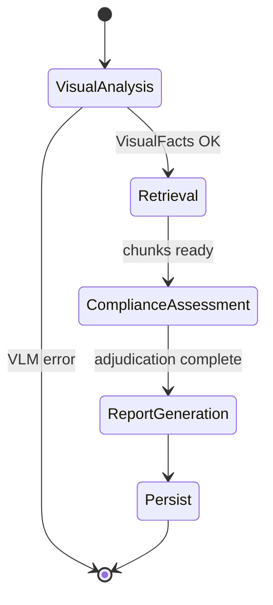

## 25.3 Benefits

- Retry specific nodes
- Human-in-the-loop interrupt before Persist on `critical`
- Tracing per node latency

---

# SECTION 26 — AWS DEPLOYMENT DESIGN **[FUTURE]**

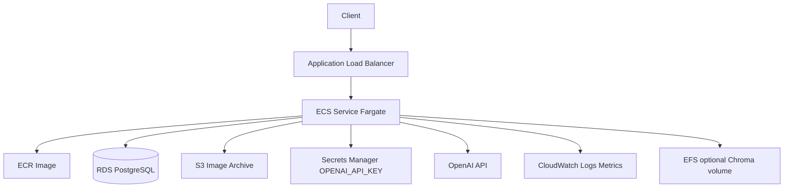

| Component | Role |
|-----------|------|
| **ECR** | Store Docker images from CI |
| **ECS** | Run FastAPI tasks autoscaling on CPU/latency |
| **RDS** | Reports + metadata (post Phase 1) |
| **IAM** | Task role: S3 read/write, Secrets read, no admin |
| **CloudWatch** | Logs, alarms on 5xx rate, OpenAI latency |

---

# SECTION 27 — TERRAFORM DESIGN **[FUTURE]**

## 27.1 Module Structure

```text
terraform/
├── environments/
│   dev/
│   prod/
├── modules/
│   network/
│   ecs_service/
│   rds/
│   alb/
```

## 27.2 Workflow

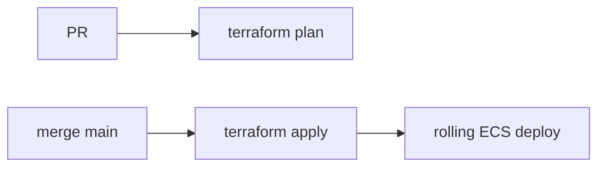

## 27.3 Core Resources

- VPC, subnets, security groups
- ALB + target group + listener
- ECS cluster, task definition, service
- ECR repository
- RDS instance (optional dev: smaller instance)
- IAM roles and policies
- CloudWatch log groups

---

# SECTION 28 — FINAL ASSESSMENT

## 28.1 Current Ratings (Honest) **[CURRENT]**

| Dimension | Score / 10 | Rationale |
|-----------|------------|-----------|
| **Overall project** | **7.0** | Excellent portfolio architecture for size; not production-complete |
| Backend Engineering | 7.5 | Clean FastAPI layering, typed API, persistence + retrieval |
| AI Engineering | 6.5 | Strong structured VLM; weak evals, heuristic escalation, no RAG |
| Production Readiness | 4.0 | No auth, CI, observability, HA storage, or cloud deploy |
| FDE Relevance | 8.0 | Strong narrative for customer-facing AI integration demos |

## 28.2 Expected Ratings After Roadmap **[FUTURE — estimated]**

| Dimension | After Phases 1–3 | After Phases 1–6 |
|-----------|------------------|------------------|
| Overall | 8.0 | 8.5–9.0 |
| Backend | 8.5 | 9.0 |
| AI Engineering | 8.0 | 8.5–9.0 |
| Production Readiness | 6.5 | 8.0–8.5 |
| FDE Relevance | 8.5 | 9.0 |

*Assumption:* Roadmap executed with discipline (real evals, not checkbox Chroma).

## 28.3 Closing Summary

**[CURRENT]** This repository is a **well-architected multimodal API prototype** that convincingly demonstrates enterprise visual intelligence patterns: structured VLM extraction, policy grounding, escalation reporting, JSON audit persistence, Docker, and testable AI boundaries.

**[FUTURE]** It becomes **interview- and production-competitive** when backed by CI, observability, auth, real persistence, semantic RAG, evaluation metrics, orchestration, and cloud IaC—without overstating what exists today.

---

## Appendix A — Environment Variables **[CURRENT]**

| Variable | Required | Default | Purpose |
|----------|----------|---------|---------|
| `OPENAI_API_KEY` | Yes (live analyze) | `""` | OpenAI authentication |
| `OPENAI_MODEL` | No | `gpt-4o-mini` | VLM model id |

Loaded via `pydantic-settings` from `.env`.

## Appendix B — `input_type` Taxonomy **[CURRENT]**

| Value | Policy file | Typical use |
|-------|-------------|-------------|
| `warehouse_scene` | warehouse_safety_rules.md | Aisle safety |
| `retail_shelf` | retail_shelf_rules.md | Shelf compliance |
| `equipment_inspection` | equipment_inspection_rules.md | Asset condition |
| `dashboard_screenshot` | dashboard_anomaly_policy.md | KPI monitoring |
| `inventory_delivery` | inventory_escalation_policy.md | Stock / delivery |
| `unknown` | *(none)* | Fallback |

## Appendix C — HTTP Status Quick Reference **[CURRENT]**

| Code | Endpoint(s) | Meaning |
|------|-------------|---------|
| 200 | All success paths | OK |
| 400 | POST /analyze | Invalid image MIME |
| 404 | GET /reports/{id} | Missing report file |
| 500 | POST /analyze | VLM JSON parse/validation failure |
| 502 | POST /analyze | OpenAI request failure |

## Appendix D — Assumptions Documented

1. Target users and industries are **inferred** from README and policy docs—not encoded as personas in code.
2. No live OpenAI calls were made during handbook generation; VLM behaviour described from `vision_service.py` source.
3. `chromadb` in `requirements.txt` has **no application imports**—treated as unused dependency / future placeholder.
4. Page count “40–60+ pages equivalent” depends on print/PDF settings; content density targets comprehensive coverage per user request.

---

## Appendix E — Full Policy Corpus **[CURRENT]**

The following policy texts ship in `context_docs/` and are returned verbatim (as a single string element) in `retrieved_context` when the VLM classifies the matching `input_type`.

### E.1 `warehouse_safety_rules.md`

```markdown
# Warehouse Safety Rules

- If emergency exits, walkways, or fire equipment are visibly blocked, classify as critical.
- If boxes are stacked unsafely or leaning, classify as high.
- If liquid spills or floor obstructions are visible, classify as high.
```

**Interaction with escalation logic:** The word `critical` appears in policy text. Combined with `possible_risks` containing terms like `walkway` or `blocked`, `report_service` can assign `escalation_level: critical` (see persisted sample report `ef606573-c1e0-4994-88c8-6bda6148a07e.json`).

### E.2 `retail_shelf_rules.md`

```markdown
# Retail Shelf Rules

- If more than 30% of shelf-facing space appears empty, classify as medium priority replenishment.
- If promotional items are missing from expected shelf space, classify as low or medium depending on visibility.
- If products appear blocked, damaged, or inaccessible, flag for store associate review.
```

**Gap:** Policy mentions `medium` and `low` priorities; escalation logic does not parse “30%” or replenishment semantics—only `critical` and `high` keywords in full policy text affect escalation branches.

### E.3 `equipment_inspection_rules.md`

```markdown
# Equipment Inspection Rules

- If visible corrosion, exposed wiring, leakage, cracks, or missing safety covers are present, classify as high or critical.
- If warning indicators or abnormal dashboard readings are visible, flag for maintenance review.
- If equipment appears operational but dirty or worn, classify as low or medium.
```

### E.4 `dashboard_anomaly_policy.md`

```markdown
# Dashboard Anomaly Policy

- If a business dashboard shows a KPI drop greater than 15%, classify as medium.
- If multiple KPIs are simultaneously declining, classify as high.
- If financial, customer, or operational metrics show sudden extreme changes, recommend escalation.
```

### E.5 `inventory_escalation_policy.md`

```markdown
# Inventory Escalation Policy

- Missing inventory under 10% is low priority.
- Missing inventory between 10% and 30% is medium priority.
- Missing inventory over 30% is high priority.
- Safety-related issues override inventory priority and should be escalated first.
```

**Design note:** Inventory percentages require the VLM to estimate or state percentages in `possible_risks` for keyword logic to have any effect—the application does not compute percentages from pixels.

---

## Appendix F — Escalation Truth Table **[CURRENT]**

Let `has_risks = len(possible_risks) > 0`, `context_text = lower(join(retrieved_context))`, `risks_text = lower(join(possible_risks))`.

| has_risks | "critical" in context | any critical_term in risks | "high" in context | Result escalation | Issue severity |
|-----------|----------------------|----------------------------|-------------------|-------------------|----------------|
| false | * | * | * | low | medium (unused—no issues) |
| true | yes | yes | * | critical | critical |
| true | yes | no | * | medium | medium |
| true | no | * | yes | high | high |
| true | no | * | no | medium | medium |

`critical_terms` = {blocked, exit, walkway, fire, obstruction}.

**Observed behaviour:** Retail policy without the substring `high` or `critical` may yield `medium` escalation even when risks exist—because only the second branch checks `"high" in context_text`.

---

## Appendix G — Complete Application Source Inventory **[CURRENT]**

| File | Lines (approx.) | Public symbols |
|------|-----------------|----------------|
| `app/main.py` | 17 | `app`, `read_root` |
| `app/config.py` | 12 | `Settings`, `settings` |
| `app/schemas.py` | 47 | `Issue`, `VisualFacts`, `VisualAnalysisReport` |
| `app/routes/analyze.py` | 22 | `router`, `analyze` |
| `app/routes/health.py` | 12 | `router`, `health_check` |
| `app/routes/reports.py` | 15 | `router`, `get_report` |
| `app/services/vision_service.py` | 62 | `client`, `analyze_image_with_vlm` |
| `app/services/context_service.py` | 21 | `get_context_for_input_type`, `CONTEXT_BY_INPUT_TYPE` |
| `app/services/report_service.py` | 56 | `generate_report_from_visual_facts` |
| `app/services/storage_service.py` | 19 | `save_report`, `load_report`, `REPORTS_DIR` |
| `app/utils/image_utils.py` | 18 | `validate_image_file`, `encode_image_to_base64` |

**Total application Python:** ~300 lines excluding tests—intentionally compact.

---

## Appendix H — VLM System Prompt Analysis **[CURRENT]**

The system prompt in `vision_service.py` instructs the model to:

1. Act as an “enterprise visual operations analyst.”
2. Return **only** valid JSON with keys: `input_type`, `summary`, `detected_entities`, `visual_facts`, `possible_risks`.
3. Populate `detected_entities` with at least three items when possible.
4. Use one of six allowed `input_type` literals.

**Engineering implications:**

| Prompt choice | Benefit | Risk |
|---------------|---------|------|
| JSON-only | Parseable | Model may still add preamble despite instruction |
| Entity minimum | Richer reports | Model may invent entities to satisfy count |
| Closed `input_type` set | Routes policy | Misclassification sends wrong policy file |
| No few-shot examples | Shorter prompt | Higher variance across runs |

**[FUTURE] improvements:** Few-shot examples per domain; confidence in JSON; explicit “cannot determine” flags; refusal for non-operational images.

---

## Appendix I — Security & Threat Model **[CURRENT + FUTURE]**

### I.1 Current attack surface **[CURRENT]**

| Threat | Exposure | Mitigation today |
|--------|----------|------------------|
| Unauthenticated abuse of `/analyze` | High | None |
| OpenAI API key exfiltration via logs | Medium if logs added carelessly | No logging of key in code |
| Large file DoS | Read full file to memory | None (no size cap) |
| Report ID enumeration | UUID filenames reduce guessability | No rate limit |
| MIME spoofing | Trust client `content_type` | Weak—no magic-byte check |

### I.2 **[FUTURE]** hardening checklist

- API key or OAuth2 on all mutating routes
- `Content-Length` and max bytes limits (e.g. 10 MB)
- `python-magic` or PIL verify image bytes
- Rate limiting per API key
- Private networking for ECS tasks
- Secrets Manager for `OPENAI_API_KEY`
- PII redaction in logs

---

## Appendix J — Operational Runbook **[CURRENT]**

### J.1 Local development

```bash
python -m venv .venv
source .venv/bin/activate
pip install -r requirements.txt
# Create .env with OPENAI_API_KEY and optional OPENAI_MODEL
uvicorn app.main:app --reload
```

Verify: `curl http://localhost:8000/health`

### J.2 Docker

```bash
docker compose up --build
```

Verify: `curl http://localhost:8000/docs`

### J.3 Run tests

```bash
pytest -v
```

Expected: 5 test modules pass without network.

### J.4 Troubleshooting

| Symptom | Likely cause | Action |
|---------|--------------|--------|
| 502 on analyze | Invalid/missing API key, OpenAI outage | Check `.env`, test key in OpenAI dashboard |
| 500 invalid VLM output | Model returned wrong schema | Inspect prompt; add logging of `output_text` |
| Empty retrieved_context | `unknown` input_type or missing file | Verify VLM classification; check `context_docs/` paths |
| 404 on report | Wrong ID or container ephemeral disk | Use ID from analyze response; mount volume in Docker |

---

## Appendix K — Cost & Latency Model (Illustrative) **[FUTURE planning]**

*Figures are illustrative—not measured in repo.*

| Factor | Estimate driver |
|--------|-----------------|
| VLM cost | Image tokens + output tokens per `gpt-4o-mini` pricing |
| Latency | Network RTT + model inference (often 2–15s) |
| Throughput | Single sync worker ≈ 1 / latency RPS per process |

**Scaling levers:** async workers, queue (SQS), batch off-peak analysis, cache by image hash for duplicate uploads.

---

## Appendix L — Extended Interview Defense (Additional Decisions)

### L.1 Why OpenAI Responses API (not Chat Completions)?

| | |
|---|---|
| **Question** | Why `client.responses.create`? |
| **Strong answer** | “The codebase uses the Responses API with `input_image` content type, which matches OpenAI’s multimodal input model for this SDK version. I’d verify against current docs during upgrades and abstract behind a `VisionProvider` interface if we swap vendors.” |
| **Weak answer** | Unsure which API surface is used. |
| **Follow-up** | How would you abstract for Azure OpenAI or Gemini? |

### L.2 Why separate `Issue` from string risks?

| | |
|---|---|
| **Strong answer** | “`possible_risks` is raw VLM output; `Issue` adds typed severity and issue_type for ticketing integrations. Today mapping is 1:1 with duplicated evidence—a known MVP gap.” |
| **Weak answer** | “More models are better.” |

### L.3 Why UUID report IDs?

| | |
|---|---|
| **Strong answer** | “UUIDs avoid collision without a central ID service; filenames double as primary keys in JSON storage. In SQL we’d keep UUID PK and add created_at index.” |

### L.4 Why is chromadb in requirements?

| | |
|---|---|
| **Strong answer** | “Planned dependency for Phase 2 RAG—currently unused technical debt. I’d either implement minimal chunk retrieval or remove it to avoid confusion during security review.” |

### L.5 Why no `__init__.py` packages?

| | |
|---|---|
| **Strong answer** | “Python 3.11 with explicit `app` package on PYTHONPATH works for this layout; pytest.ini sets `pythonpath = .`. For packaging to PyPI I’d add `__init__.py` files and `pyproject.toml`.” |

---

## Appendix M — Extended System Design Talking Points (30-Minute Deep Dive)

### M.1 Capacity estimation exercise (whiteboard)

**Prompt:** “10,000 images/day?”

1. Peak QPS = 10000 / 86400 ≈ 0.12 average; plan for 10× peak ≈ 1.2 QPS if bursty.
2. If VLM latency = 5s and sync handler, need ~6 concurrent workers per sustained 1.2 QPS → move to async queue.
3. Storage: 10k JSON files/day × ~5 KB ≈ 50 MB/day → RDS or S3 lifecycle.

### M.2 Multi-tenant extension **[FUTURE]**

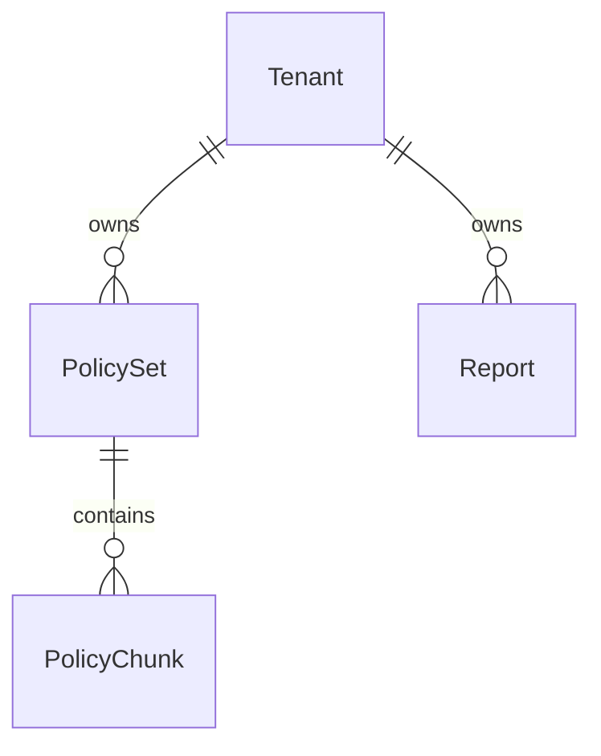

Add `tenant_id` header → filter Chroma collection and SQL rows.

### M.3 Human-in-the-loop **[FUTURE]**

For `escalation_level == critical`, write report with `status: pending_review` before notifying ops—LangGraph interrupt node (Section 25).

---

## Appendix N — Dependency Manifest **[CURRENT]**

| Package | Version pin in repo | Used in app code |
|---------|---------------------|------------------|
| fastapi | unpinned | Yes |
| uvicorn[standard] | unpinned | Yes (Docker CMD) |
| python-multipart | unpinned | Yes (uploads) |
| pydantic | unpinned | Yes |
| pydantic-settings | unpinned | Yes |
| python-dotenv | unpinned | Via pydantic-settings |
| openai | unpinned | Yes |
| chromadb | unpinned | **No** |
| pytest | unpinned | Tests only |
| httpx | unpinned | TestClient dependency |

**Recommendation **[FUTURE]**: Pin versions in `requirements.txt` or adopt `pyproject.toml` + lockfile for reproducible builds.

---

## Appendix O — Glossary

| Term | Definition |
|------|------------|
| VLM | Vision-Language Model — multimodal LLM accepting images |
| Grounding | Connecting model outputs to authoritative policy text |
| RAG | Retrieval-Augmented Generation — embed + retrieve + generate |
| FDE | Forward Deployed Engineer — customer-facing technical implementer |
| VisualFacts | Intermediate schema — pure VLM extraction |
| VisualAnalysisReport | External schema — business report with policy and escalation |
| Escalation level | Operational priority: none/low/medium/high/critical |

---

## Appendix P — Document Revision History

| Version | Date | Notes |
|---------|------|-------|
| 1.0 | June 2026 | Initial master handbook from repository reverse-engineering |

---

## Appendix Q — Line-by-Line Test Documentation **[CURRENT]**

### Q.1 `tests/test_health.py`

| Line / block | Behaviour verified |
|--------------|-------------------|
| `TestClient(app)` | ASGI app mounts all routers |
| `GET /health` | Route registered at root level (no prefix on router) |
| Status 200 | No auth middleware blocking |
| JSON body exact match | Contract freeze for monitors |

### Q.2 `tests/test_analyze_mock.py`

| Line / block | Behaviour verified |
|--------------|-------------------|
| `VisualFacts(...)` fixture | Valid intermediate schema |
| `patch("app.routes.analyze.analyze_image_with_vlm")` | VLM bypass at correct import path |
| `files={"file": ("test.png", b"image-bytes", "image/png")}` | Multipart contract |
| Assert `input_type`, `summary` | Report service + storage + response serialization |

**Not asserted (gaps):** `report_id` presence, file created on disk, `escalation_level`, `retrieved_context` non-empty for warehouse_scene.

### Q.3 `tests/test_schema.py`

| Test | Validates |
|------|-----------|
| `test_visual_analysis_report_valid` | Happy path construction |
| `test_visual_analysis_report_invalid_input_type` | Pydantic rejects `invalid_scene` |

### Q.4 `tests/test_image_utils.py`

| Test | Validates |
|------|-----------|
| `test_encode_image_to_base64` | Non-empty string output |
| `test_validate_image_file_valid` | PNG MIME passes |
| `test_validate_image_file_invalid` | `text/plain` → HTTPException |

### Q.5 `tests/test_storage_service.py`

| Test | Validates |
|------|-----------|
| `patch REPORTS_DIR` | Isolation from real `reports/` |
| `test_save_report_creates_json_file` | File exists; content equals `model_dump()` |
| `test_load_report_returns_saved_content` | Round-trip equality |

---

## Appendix R — Failure Mode & Effects Analysis (FMEA) **[CURRENT]**

| Component | Failure | User impact | Detection | Recovery |
|-----------|---------|-------------|-----------|----------|
| OpenAI API | Timeout / 5xx | 502 | Client error | Retry **[FUTURE]** |
| OpenAI API | Invalid JSON | 500 | Client error | Prompt fix / retry |
| VLM | Wrong input_type | Wrong policy / escalation | Manual review of report | RAG + classification eval |
| Disk | Full volume | 500 on save | OS metrics | Rotate / S3 **[FUTURE]** |
| Policy file | Missing | Empty context | Empty retrieved_context | CI check policy files exist |
| Docker | No .env | 502 on analyze | Health ok but analyze fails | Document setup |

---

## Appendix S — Maintainer Onboarding Checklist

### Day 1 — Run and observe **[CURRENT]**

- [ ] Clone repo, create `.env` with OpenAI key
- [ ] `uvicorn app.main:app --reload`
- [ ] Open `/docs`, execute `GET /health`
- [ ] Upload sample image to `POST /analyze`
- [ ] `GET /reports/{report_id}` with returned ID
- [ ] Inspect `reports/*.json` on disk
- [ ] Read `context_docs/warehouse_safety_rules.md`
- [ ] Run `pytest -v`

### Day 2 — Code paths

- [ ] Trace `analyze.py` → four services
- [ ] Read `vision_service.py` prompt and error handling
- [ ] Step through escalation branches in `report_service.py`
- [ ] Map `CONTEXT_BY_INPUT_TYPE` in `context_service.py`

### Day 3 — **[FUTURE]** first contribution

- [ ] Add GitHub Actions workflow for pytest
- [ ] Add `test_report_service_escalation_critical` unit test
- [ ] Fix data URL MIME to match upload content type

---

## Appendix T — Comparison to README Production Roadmap **[CURRENT vs FUTURE]**

README lists:

| README roadmap item | Handbook section | Status |
|---------------------|------------------|--------|
| Authenticated access controls | Phase 1 auth, Appendix I | **[FUTURE]** |
| Vector retrieval over knowledge base | Phase 2, Section 23 | **[FUTURE]** |
| Policy versioning + traceability | Phase 2/6 | **[FUTURE]** |
| Async request handling | Phase 4/5 | **[FUTURE]** |
| Structured observability | Phase 1 logging | **[FUTURE]** |
| Human review for high/critical | Phase 4 LangGraph | **[FUTURE]** |

---

## Appendix U — Sample Integration Patterns for Enterprise Clients **[FUTURE guidance]**

### U.1 Webhook after analyze

```mermaid
sequenceDiagram
    participant Ops as Ops Platform
    participant API as Visual Intelligence API
    participant WH as Customer Webhook

    Ops->>API: POST /analyze
    API-->>Ops: 200 report
    Ops->>WH: POST report (async worker)
```

Not implemented—client polls `GET /reports` today.

### U.2 Batch folder processing

Cron job reads S3 prefix → POST each image → aggregates CSV of `report_id`, `escalation_level`. Requires rate limiting and queue.

### U.3 CMMS integration

Map `issues[].severity` to work order priority; map `recommended_actions` to task description template.

---

## Appendix V — FastAPI OpenAPI & Client Generation

**[CURRENT]:** FastAPI auto-generates OpenAPI 3 schema at `/openapi.json` and Swagger UI at `/docs`.

| Client | Command (illustrative) |
|--------|------------------------|
| TypeScript | `openapi-generator-cli generate -i http://localhost:8000/openapi.json` |
| Python | `openapi-python-client` |

`response_model=VisualAnalysisReport` ensures response schema includes all report fields for codegen.

---

## Appendix X — Domain Scenario Deep Dives **[CURRENT capabilities]**

### X.1 Warehouse safety workflow

**Business context:** Distribution centers capture aisle photos from supervisors or fixed cameras. OSHA-style programs require walkway clearance and fire equipment access.

**How the system handles it today:**

1. Supervisor uploads aisle photo to `POST /analyze`.
2. VLM classifies `warehouse_scene` when visual cues match racks, pallets, forklifts.
3. Full `warehouse_safety_rules.md` loads into `retrieved_context`.
4. If VLM lists a risk mentioning `walkway` and policy text contains `critical`, escalation becomes `critical`.
5. Report persists for safety manager review via `GET /reports/{id}`.

**What is NOT automated:** Regulatory filing, work order creation, re-inspection scheduling, geolocation, or comparison to prior images of same aisle.

```mermaid
flowchart TD
    A[Photo: blocked walkway] --> B[VLM: warehouse_scene + risk text]
    B --> C[Load warehouse_safety_rules.md]
    C --> D{Keyword escalation}
    D -->|critical path| E[Report: escalation critical]
    E --> F[Human verifier]
```

### X.2 Retail shelf workflow

**Business context:** Store managers photograph planogram violations, empty facings, or damaged goods.

**Current behaviour:** `retail_shelf` policy loads; escalation often stays `medium` because policy text uses phrases like “medium priority” but keyword logic searches for substring `high` or `critical` in the **entire** policy body—not structured rule parsing.

**Interview point:** Demonstrates why **[FUTURE]** structured policy rules (YAML) or LLM adjudication with citations would improve fidelity.

### X.3 Equipment inspection workflow

**Business context:** Technicians photograph motors, panels, or leaks during rounds.

**Policy alignment:** Equipment rules mention `high or critical` for corrosion and wiring—VLM must surface those concepts in `possible_risks` for keyword escalation to fire.

### X.4 Dashboard screenshot workflow

**Business context:** Analysts screenshot BI tools (Tableau, Looker, internal dashboards) when KPIs spike or drop.

**Limitation:** The VLM cannot compute exact percentage drops from pixels reliably; policy references “15% KPI drop” but application does not validate numeric claims against structured KPI data—would need OCR + structured dashboard parsing **[FUTURE]** for production finance use cases.

### X.5 Inventory delivery workflow

**Business context:** Dock photos or packing manifests showing shortage or damage.

**Policy:** Tiered missing-inventory percentages—again requires VLM to articulate approximate shortage in natural language risks for heuristics to matter.

---

## Appendix Y — SQLAlchemy Detailed Migration Spec **[FUTURE]**

### Y.1 DDL (SQLite-compatible)

```sql
CREATE TABLE reports (
    id TEXT PRIMARY KEY,
    input_type TEXT NOT NULL,
    summary TEXT NOT NULL,
    detected_entities JSON NOT NULL,
    visual_facts JSON NOT NULL,
    issues JSON NOT NULL,
    retrieved_context JSON NOT NULL,
    recommended_actions JSON NOT NULL,
    escalation_level TEXT NOT NULL,
    confidence REAL NOT NULL,
    limitations JSON NOT NULL,
    created_at TIMESTAMP DEFAULT CURRENT_TIMESTAMP NOT NULL
);

CREATE INDEX idx_reports_input_type ON reports(input_type);
CREATE INDEX idx_reports_escalation ON reports(escalation_level);
CREATE INDEX idx_reports_created_at ON reports(created_at DESC);
```

### Y.2 Repository interface

```python
# Conceptual interface — not in repository
class ReportRepository(Protocol):
    def save(self, report: VisualAnalysisReport) -> str: ...
    def get(self, report_id: str) -> VisualAnalysisReport: ...
    def list(
        self,
        input_type: str | None = None,
        escalation_level: str | None = None,
        limit: int = 50,
    ) -> list[VisualAnalysisReport]: ...
```

### Y.3 Dual-write migration window

```mermaid
flowchart LR
    A[POST /analyze] --> B[save_report]
    B --> JSON[reports/*.json]
    B --> SQL[(SQLite)]
```

Run dual-write for one release; compare checksums; cut over reads to SQL; deprecate JSON.

### Y.4 Alembic revision strategy

| Revision | Change |
|----------|--------|
| 001 | Create `reports` table |
| 002 | Add `tenant_id` nullable **[FUTURE multi-tenant]** |
| 003 | Add `vlm_model_version`, `policy_version` metadata |

---

## Appendix Z — RAG Implementation Blueprint **[FUTURE]**

### Z.1 Indexing pseudocode

```python
# Pseudocode — not in repository
for path in CONTEXT_DOCS_DIR.glob("*.md"):
    input_type = FILENAME_TO_TYPE[path.name]
    for chunk in chunk_markdown(path.read_text()):
        embedding = openai.embeddings.create(model="text-embedding-3-small", input=chunk.text)
        collection.add(
            ids=[f"{input_type}:{chunk.index}"],
            embeddings=[embedding],
            documents=[chunk.text],
            metadatas=[{"input_type": input_type, "source": path.name}],
        )
```

### Z.2 Query pseudocode

```python
def retrieve_policy_chunks(visual_facts: VisualFacts, k: int = 5) -> list[str]:
    query = " ".join([visual_facts.summary, *visual_facts.possible_risks])
    results = collection.query(
        query_texts=[query],
        n_results=k,
        where={"input_type": visual_facts.input_type},
    )
    return results["documents"][0]
```

### Z.3 Hybrid retrieval **[FUTURE advanced]**

Combine:

- **Filter:** `input_type` must match (avoid retail policy for warehouse image).
- **Semantic:** top-k chunks within filter.
- **Keyword:** BM25 fallback for exact regulatory terms (“OSHA”, “fire exit”).

### Z.4 Chroma persistence layout

```text
data/chroma/
├── chroma.sqlite3
└── ...
```

Mount as Docker volume for index survival across restarts.

---

## Appendix AA — Evaluation Dataset Design **[FUTURE]**

### AA.1 Gold label schema

```json
{
  "image_id": "warehouse_001",
  "expected_input_type": "warehouse_scene",
  "min_entities": ["pallet", "walkway"],
  "required_risk_substrings": ["walkway", "block"],
  "expected_escalation_min": "high",
  "policy_citations": ["walkways should remain clear"]
}
```

### AA.2 Scoring function (conceptual)

```python
def score_report(gold: dict, report: VisualAnalysisReport) -> dict:
    return {
        "type_ok": report.input_type == gold["expected_input_type"],
        "escalation_ok": SEVERITY_RANK[report.escalation_level] >= SEVERITY_RANK[gold["expected_escalation_min"]],
        "entity_recall": recall(gold["min_entities"], report.detected_entities),
    }
```

### AA.3 CI integration

| Gate | Threshold |
|------|-----------|
| schema_validity_rate | 100% on mock + 98% live |
| type_accuracy | ≥ 85% on holdout |
| critical_escalation_recall | ≥ 95% on safety set |

---

## Appendix AB — LangGraph State Schema **[FUTURE]**

```python
# Illustrative TypedDict
class AnalysisState(TypedDict):
    image_b64: str
    visual_facts: VisualFacts | None
    policy_chunks: list[str]
    issues: list[Issue]
    report: VisualAnalysisReport | None
    error: str | None
```

### AB.1 Node responsibilities

| Node | Reads | Writes |
|------|-------|--------|
| `visual_analysis` | image_b64 | visual_facts or error |
| `retrieval` | visual_facts | policy_chunks |
| `compliance` | visual_facts, policy_chunks | issues, escalation draft |
| `report_generation` | all | report |
| `persist` | report | filesystem/DB |

### AB.2 Conditional edges

```mermaid
flowchart TD
    VA[visual_analysis] -->|success| RET[retrieval]
    VA -->|error| END1[END]
    RET --> COMP[compliance]
    COMP -->|critical| HITL[human_review optional]
    COMP --> REP[report_generation]
    HITL --> REP
    REP --> PER[persist]
```

---

## Appendix AC — AWS Resource Catalog **[FUTURE]**

| AWS service | Resource | Purpose |
|-------------|----------|---------|
| ECR | `evi-api` repo | Container images |
| ECS | Cluster + Fargate service | Run API tasks |
| ALB | Target group port 8000 | HTTPS ingress |
| ACM | Certificate | TLS |
| RDS | PostgreSQL db.t4g.micro | Reports **[post SQL migration]** |
| S3 | `evi-images-{env}` | Optional raw image archive |
| Secrets Manager | `openai-api-key` | Inject into task definition |
| CloudWatch | Log group `/ecs/evi-api` | Logs |
| CloudWatch | Alarm `5xxRate` | Paging |
| IAM | Task execution role | ECR pull, logs |
| IAM | Task role | S3, Secrets read |
| VPC | 2 AZ public+private subnets | Network isolation |
| NAT Gateway | Optional | Outbound OpenAI from private tasks |

### AC.1 Network diagram

```mermaid
flowchart TB
    subgraph Public
        ALB[ALB]
    end
    subgraph Private
        ECS[ECS Tasks]
        RDS[(RDS)]
    end
    Internet((Internet)) --> ALB
    ALB --> ECS
    ECS --> RDS
    ECS --> Internet
```

---

## Appendix AD — Terraform Snippet Outline **[FUTURE]**

```hcl
# Illustrative — not in repository
module "vpc" {
  source = "./modules/network"
  cidr   = var.vpc_cidr
}

module "ecs_service" {
  source          = "./modules/ecs_service"
  cluster_id      = aws_ecs_cluster.main.id
  image           = "${var.ecr_url}:latest"
  desired_count   = var.desired_count
  subnet_ids      = module.vpc.private_subnet_ids
  security_groups = [aws_security_group.ecs_tasks.id]
}
```

**Workflow:** `terraform plan` on PR → `terraform apply` on tagged release → ECS rolling deployment.

---

## Appendix AE — Additional Resume Variants

### Staff / Principal engineer

- Defined **multimodal reference architecture** for policy-grounded visual ops: perception schema, retrieval boundary, escalation contract, and persistence—enabling team alignment on what to harden for production.
- Drove **explicit technical debt register** (unused chromadb, static confidence, MIME mismatch) with phased remediation tied to risk.

### Applied scientist collaboration

- Partnered with domain experts to encode **five operational policy corpora** as markdown grounding sources with transparent retrieval in API responses.
- Specified **[FUTURE] eval harness** requirements: safety-critical recall targets and schema validity gates before model prompt changes.

---

## Appendix AF — Additional STAR Stories

### AF.1 Tradeoff: sync vs async

**Situation:** VLM latency could exceed HTTP gateway timeouts at scale.  
**Task:** Ship MVP without queue infrastructure.  
**Action:** Documented sync limitation; designed **[FUTURE]** SQS + worker contract in handbook; kept route thin for later swap to 202 Accepted pattern.  
**Result:** Honest architecture story in interviews; clear upgrade path.

### AF.2 Tradeoff: full policy vs chunks

**Situation:** Small policy files made full-file retrieval acceptable.  
**Task:** Decide retrieval unit.  
**Action:** Chose deterministic full-file read; documented when to migrate to Chroma (policy growth, cross-file search).  
**Result:** Shipped grounding quickly without vector ops burden.

### AF.3 Documentation for handoff

**Situation:** Future maintainers need faster onboarding than README alone.  
**Task:** Capture **CURRENT** vs **FUTURE** unambiguously.  
**Action:** Authored `docs/TECHNICAL_CONTEXT.md` and this master handbook from source truth.  
**Result:** Reduced misrepresentation risk in interviews and hiring loops.

---

## Appendix AG — `vision_service.py` Error Path Matrix **[CURRENT]**

| Exception / condition | HTTP | detail string |
|----------------------|------|---------------|
| Any exception in `responses.create` | 502 | Vision model request failed |
| `JSONDecodeError` on output_text | 500 | Failed to parse VLM response |
| Pydantic `ValidationError` | 500 | Invalid structured VLM output |
| Success | — | Returns `VisualFacts` |

**Observation:** OpenAI-specific exceptions (rate limit, auth) are not distinguished—operators see generic 502.

---

## Appendix AH — Report Field Population Matrix **[CURRENT]**

| Field | Source |
|-------|--------|
| report_id | `uuid.uuid4()` in report_service |
| input_type | VLM `VisualFacts.input_type` |
| summary | VLM |
| detected_entities | VLM |
| visual_facts | VLM |
| issues | Derived 1:1 from `possible_risks` |
| retrieved_context | context_service full file |
| recommended_actions | Template `Review and address: {risk}` |
| escalation_level | Keyword rules |
| confidence | Constant 0.85 |
| limitations | Static disclaimer list |

---

## Appendix W — Intellectual Honesty Checklist for Interviews

When presenting this project, explicitly state:

1. **Policy retrieval is not embedding RAG** — it is file lookup by classification.
2. **Escalation is heuristic** — not LLM or rules engine.
3. **Confidence is static** — not calibrated.
4. **chromadb is unused** — remove or implement.
5. **No CI in repo** — tests exist but not automated on push.
6. **Reports in Docker are ephemeral** — unless volume mounted.

Interviewers reward candidates who distinguish **demo** from **production**.

---

*End of Enterprise Visual Intelligence API Master Engineering Handbook*
