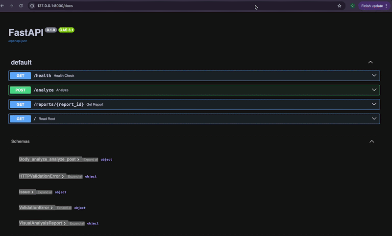
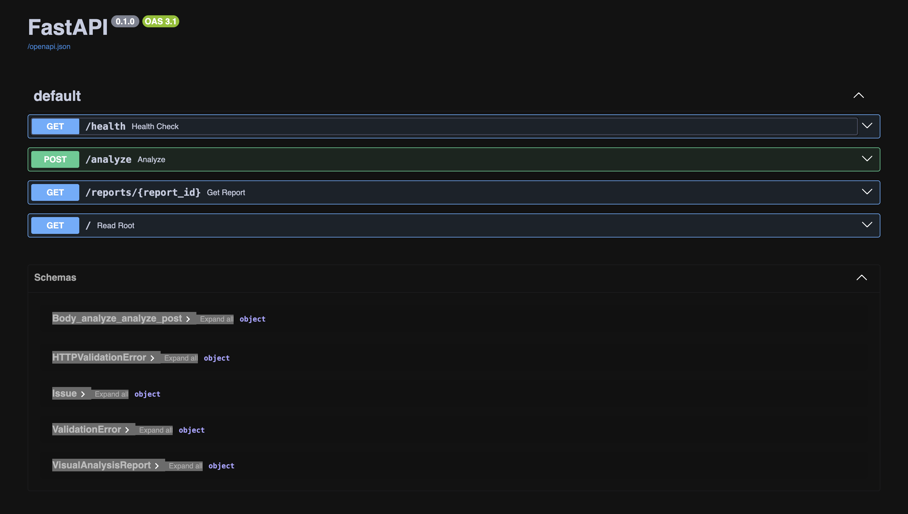
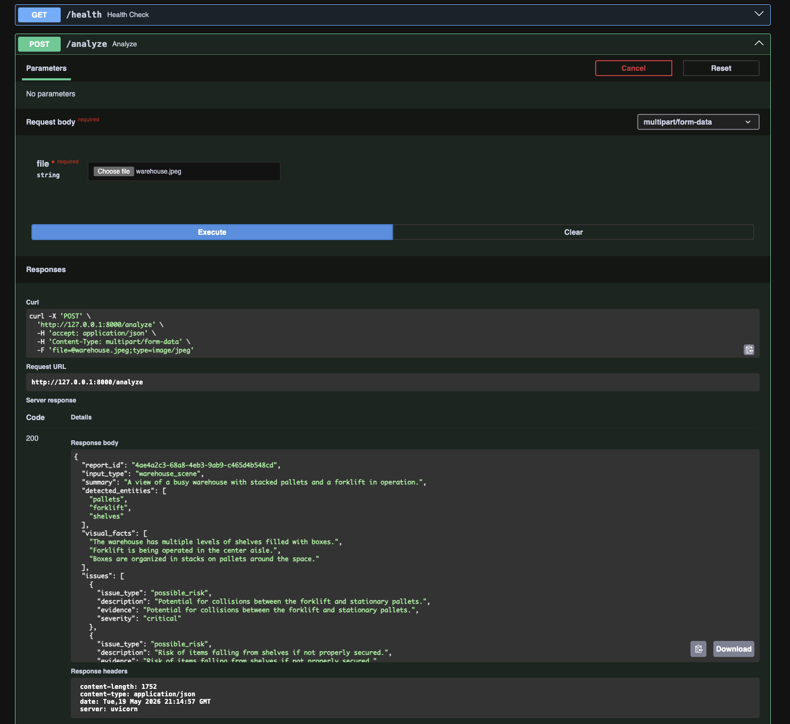
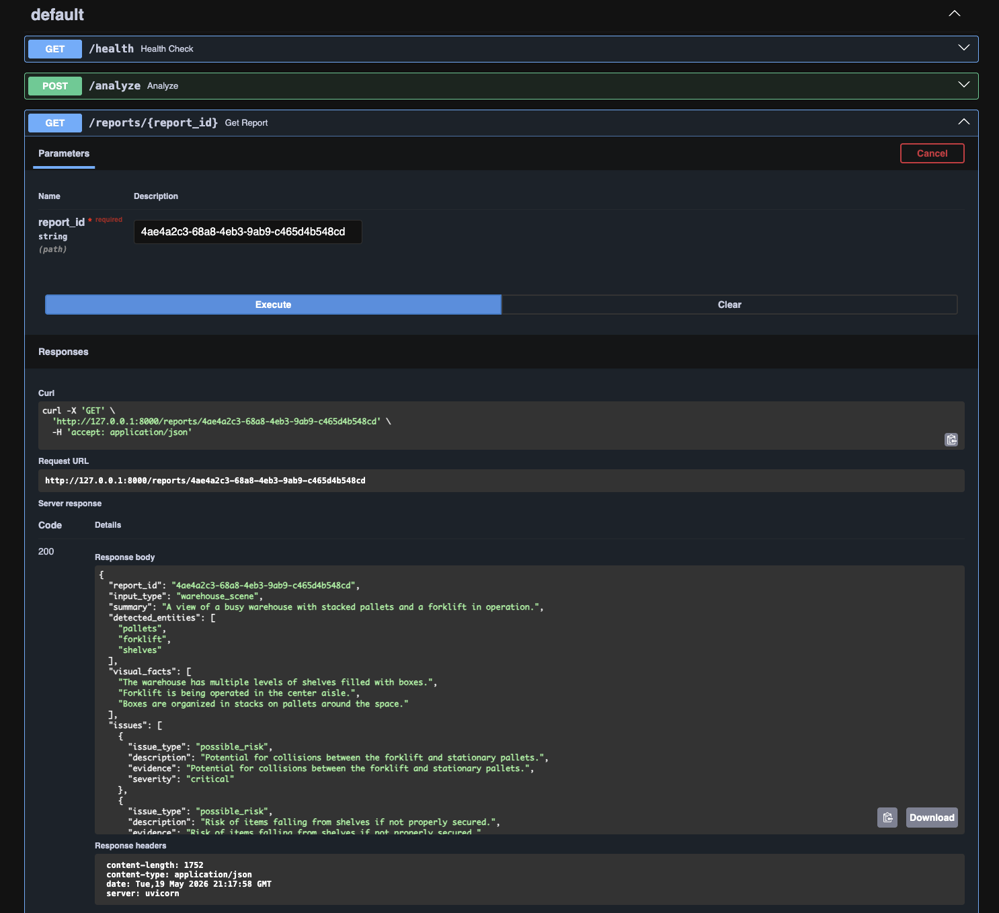

# Enterprise Multimodal Visual Intelligence API

Enterprise Multimodal Visual Intelligence API is a multimodal operational analysis platform for evaluating business images against operational policies and generating structured AI reports.




## Overview

The system accepts uploaded images, analyzes visible operational conditions with a vision-language model, retrieves policy context for the detected scenario, and returns a policy-aware report with risks, evidence, recommended actions, escalation level, confidence, and limitations.

The project is designed as an enterprise visual intelligence system for use cases such as warehouse safety review, retail shelf assessment, equipment inspection, dashboard anomaly review, and inventory delivery analysis.

The system is designed to simulate production-style enterprise AI workflows where multimodal analysis must be grounded against operational policy context before generating escalation-aware reports.

## Why This Matters for Enterprise Deployment

This project demonstrates how multimodal AI systems can be integrated into operational enterprise workflows where image analysis must be grounded against policy context, escalation logic, persistence, and structured reporting requirements.

The system is designed to simulate production-style AI infrastructure patterns including:
- multimodal ingestion
- structured AI extraction
- contextual retrieval
- policy-aware reasoning
- operational persistence
- deployment-oriented API workflows


## Analysis Pipeline

```text
Image Upload
→ Image Validation
→ Base64 Encoding
→ OpenAI Vision Analysis
→ Structured VisualFacts Extraction
→ Context Retrieval
→ Policy-Aware Report Generation
→ VisualAnalysisReport Response
```

## Key Features

- Image upload endpoint for operational visual analysis.
- Vision-language model integration for extracting structured visual facts.
- Policy-aware reporting based on local context documents.
- Typed response models for issues, visual facts, escalation levels, and recommended actions.
- Input classification across warehouse, retail, equipment, dashboard, inventory, and unknown scenarios.
- Health check endpoint for service monitoring.
- Test coverage for API health, schemas, image validation, and mocked analysis behavior.

## System Architecture

The service follows a compact FastAPI architecture:

1. A client uploads an image to the `/analyze` endpoint.
2. The API validates the uploaded file and converts it to base64.
3. The vision service sends the image to the configured OpenAI vision model.
4. The model returns structured visual facts as JSON.
5. The report service maps the detected `input_type` to relevant policy context from `context_docs/`.
6. The report service combines visual findings, retrieved policy context, and rule-based escalation logic into a typed `VisualAnalysisReport`.
7. The API returns the report as JSON.

Core components:

- `app/main.py`: FastAPI application initialization and route registration.
- `app/routes/analyze.py`: Image analysis endpoint.
- `app/routes/health.py`: Health check endpoint.
- `app/routes/reports.py`: Report retrieval endpoint.
- `app/services/vision_service.py`: OpenAI multimodal analysis integration.
- `app/services/storage_service.py`: JSON report persistence under `reports/`.
- `app/services/context_service.py`: Policy document retrieval by input type.
- `app/services/report_service.py`: Report assembly, issue generation, and escalation logic.
- `app/schemas.py`: Pydantic models for API response contracts.
- `context_docs/`: Domain policy documents used during report generation.

## Architecture Flow

```text
Client Upload
    ↓
FastAPI Endpoint
    ↓
Image Validation
    ↓
Base64 Encoding
    ↓
OpenAI Vision Model
    ↓
Structured VisualFacts Extraction
    ↓
Context Retrieval
    ↓
Policy-Aware Report Generation
    ↓
Report Persistence
    ↓
Report Retrieval API
```

## API Documentation



## Analysis Request



## Example Report Response



## Example Workflow

1. An operations system uploads a warehouse aisle image to `/analyze`.
2. The API validates the file and prepares the image for multimodal analysis.
3. The vision model identifies visible entities such as pallets, walkways, storage racks, or equipment.
4. The model returns observable facts and possible operational risks.
5. The system retrieves the warehouse safety policy context.
6. The report service evaluates the risks against policy language and assigns an escalation level.
7. The client receives a structured report that can be displayed, reviewed, stored, or routed into an operations workflow.

## Tech Stack

- Python
- FastAPI
- Pydantic
- Pydantic Settings
- OpenAI Responses API
- Uvicorn
- Python multipart uploads
- Pytest
- HTTPX

## Project Structure

```text
.
├── app/
│   ├── main.py
│   ├── config.py
│   ├── schemas.py
│   ├── routes/
│   │   ├── analyze.py
│   │   ├── health.py
│   │   └── reports.py
│   ├── services/
│   │   ├── context_service.py
│   │   ├── report_service.py
│   │   ├── storage_service.py
│   │   └── vision_service.py
│   └── utils/
│       └── image_utils.py
├── reports/
├── screenshots/
├── context_docs/
│   ├── dashboard_anomaly_policy.md
│   ├── equipment_inspection_rules.md
│   ├── inventory_escalation_policy.md
│   ├── retail_shelf_rules.md
│   └── warehouse_safety_rules.md
├── tests/
│   ├── test_analyze_mock.py
│   ├── test_health.py
│   ├── test_image_utils.py
│   ├── test_schema.py
│   └── test_storage_service.py
├── Dockerfile
├── docker-compose.yml
├── .dockerignore
├── pytest.ini
├── requirements.txt
└── README.md
```

## API Endpoints

### `GET /`

Returns a basic service identification response.

Example response:

```json
{
  "message": "Enterprise Multimodal Visual Intelligence API"
}
```

### `GET /health`

Returns service health information for monitoring and readiness checks.

Example response:

```json
{
  "status": "ok",
  "service": "enterprise-visual-intelligence-api"
}
```

### `POST /analyze`

Accepts an uploaded image, returns a structured visual analysis report, and persists the report as JSON under `reports/` for later retrieval.

Request format:

```bash
curl -X POST "http://localhost:8000/analyze" \
  -F "file=@warehouse-aisle.png"
```

Response model:

- `report_id`: Unique report identifier.
- `input_type`: Classified operational scenario.
- `summary`: Concise operational summary.
- `detected_entities`: Visible objects or entities detected in the image.
- `visual_facts`: Observable facts from the image.
- `issues`: Policy-relevant risks with severity and evidence.
- `retrieved_context`: Policy text used to inform the report.
- `recommended_actions`: Suggested operational follow-up actions.
- `escalation_level`: Overall escalation level.
- `confidence`: Report confidence score.
- `limitations`: Notes about AI-generated analysis and verification requirements.

### `GET /reports/{report_id}`

Retrieves a previously saved JSON analysis report by `report_id`.

Returns `404` if no report file exists for the given identifier.

Request format:

```bash
curl "http://localhost:8000/reports/{report_id}"
```

Example:

```bash
curl "http://localhost:8000/reports/mock-warehouse-001"
```

## Example Response

```json
{
  "report_id": "f60a2181-1786-4315-a574-23446abf2fde",
  "input_type": "warehouse_scene",
  "summary": "Warehouse aisle shows a pallet partially blocking a marked walkway.",
  "detected_entities": [
    "pallet",
    "forklift lane",
    "walkway",
    "storage racks"
  ],
  "visual_facts": [
    "A pallet is positioned near the center of the aisle.",
    "The marked pedestrian walkway is partially obstructed."
  ],
  "issues": [
    {
      "issue_type": "safety_obstruction",
      "description": "A pallet is blocking part of the pedestrian walkway.",
      "evidence": "The pallet overlaps the floor markings for the walkway.",
      "severity": "medium"
    }
  ],
  "retrieved_context": [
    "Warehouse walkways should remain clear for safe pedestrian movement.",
    "Temporary obstructions should be moved to designated staging areas."
  ],
  "recommended_actions": [
    "Move the pallet out of the walkway.",
    "Inspect the aisle for additional obstructions."
  ],
  "escalation_level": "medium",
  "confidence": 0.86,
  "limitations": [
    "AI-generated analysis; verify findings before acting."
  ]
}
```

## Local Development Setup

Create and activate a virtual environment:

```bash
python -m venv .venv
source .venv/bin/activate
```

Install dependencies:

```bash
pip install -r requirements.txt
```

Create a local `.env` file:

```env
OPENAI_API_KEY=your_openai_api_key
OPENAI_MODEL=gpt-4o-mini
```

Run the API locally:

```bash
uvicorn app.main:app --reload
```

Docker deployment:

```bash
docker compose up --build
```

Run tests:

```bash
pytest
```

## Production Roadmap

- Add authenticated access controls for enterprise deployments.
- Replace local policy document lookup with vector retrieval over a managed knowledge base.
- Add organization-specific policy versioning and report traceability.
- Add async request handling for larger image workloads.
- Add structured observability for model latency, policy retrieval, and escalation outcomes.
- Add human review workflow integrations for high and critical escalations.
